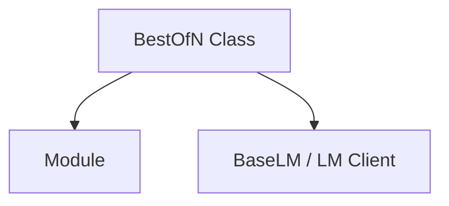

# BestOfN Strategy Module

The `best_of_n_strategy` module provides a robust mechanism to enhance the reliability and quality of predictions generated by a DSPy module. It achieves this by executing a given module multiple times, evaluating each attempt using a defined reward function, and ultimately selecting the best outcome or the first one that satisfies a specified performance threshold.

## Core Functionality

The primary component of this module is the `BestOfN` class, which encapsulates the logic for orchestrating multiple prediction attempts and selecting the optimal result.

### BestOfN

`dspy.predict.best_of_n.BestOfN`

The `BestOfN` class extends `dspy.primitives.module.Module` and is designed to wrap another DSPy module, enabling it to execute multiple "rollouts" of that module. This strategy is particularly useful when the underlying module might produce varying quality outputs, and a mechanism is needed to ensure the best possible prediction is chosen.

**Key Features:**

*   **Multiple Attempts (N):** Executes the wrapped module `N` times.
*   **Reward Function (`reward_fn`):** A custom callable that assesses the quality of each prediction, returning a scalar reward.
*   **Thresholding:** Allows for early stopping if a prediction achieves a reward score greater than or equal to a defined `threshold`.
*   **Failure Handling:** Provides a `fail_count` parameter to control how many attempts can fail before an error is propagated.
*   **Temperature Control:** Each attempt is run with `temperature=1.0` to encourage diversity in generated outputs.

**Constructor Arguments:**

*   `module` ([dspy_primitives.module.Module](dspy_primitives.md)): The DSPy module to be run multiple times.
*   `N` (int): The number of times to execute the `module`.
*   `reward_fn` (Callable[[dict, Prediction], float]): A function that takes the arguments passed to the module and the resulting prediction, returning a scalar reward.
*   `threshold` (float): The minimum reward score required for a prediction to be considered acceptable, allowing early termination.
*   `fail_count` (Optional[int]): The maximum number of failed attempts allowed before raising an exception. Defaults to `N`.

**Example Usage:**

```python
import dspy

dspy.configure(lm=dspy.LM("openai/gpt-4o-mini"))

# Define a QA module with chain of thought
qa = dspy.ChainOfThought("question -> answer")

# Define a reward function that checks for one-word answers
def one_word_answer(args, pred):
    return 1.0 if len(pred.answer.split()) == 1 else 0.0

# Create a refined module that tries up to 3 times
best_of_3 = dspy.BestOfN(module=qa, N=3, reward_fn=one_word_answer, threshold=1.0)

# Use the refined module
result = best_of_3(question="What is the capital of Belgium?").answer
# Returns: Brussels
```

## Architecture and Component Relationships

The `BestOfN` strategy integrates with core DSPy components to manage prediction generation and evaluation.

<!-- DIAGRAM_JSON
{
    "direction": "TD",
    "nodes": [
        {"id": "best_of_n_component", "label": "BestOfN Class", "type": "component", "link": null},
        {"id": "dspy_module", "label": "Module", "type": "external", "link": "dspy_primitives.md"},
        {"id": "dspy_lm_client", "label": "BaseLM / LM Client", "type": "external", "link": "dspy_clients.md"}
    ],
    "edges": [
        {"source": "best_of_n_component", "target": "dspy_module"},
        {"source": "best_of_n_component", "target": "dspy_lm_client"}
    ],
    "groups": []
}
-->


### Relationships:

*   **`BestOfN` and `Module`:** The `BestOfN` class wraps an instance of `dspy.primitives.module.Module`, executing its `forward` method multiple times.
*   **`BestOfN` and `LM Client`:** `BestOfN` interacts with the configured Language Model (LM) client (e.g., through `dspy.clients.base_lm.BaseLM` or specific implementations) to manage `rollout_id` and `temperature` settings for each attempt.

## How it Fits into the Overall System

The `best_of_n_strategy` module is a vital part of the `dspy_prediction_strategies.module_optimization` family. It serves as an optimization technique to improve the robustness and quality of predictions from any DSPy module. By allowing multiple attempts and a configurable reward-based selection, it enables developers to mitigate the inherent variability of language models and achieve more reliable outputs, especially in critical applications. It complements other optimization strategies within the `dspy_prediction_strategies` module by providing a direct way to enhance the performance of individual modules.