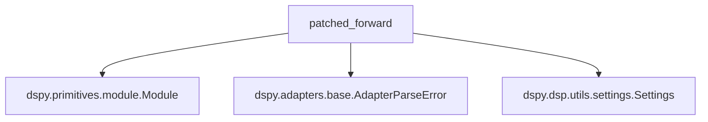

# bootstrap_trace

## Introduction
The `bootstrap_trace` module is a vital component within the `dspy.teleprompt` ecosystem, specifically designed to enhance the robustness of program execution during teleprompting by intercepting and handling parsing errors. It plays a crucial role in enabling teleprompting optimizers to learn from both successful executions and failures, particularly those related to the formatting of Language Model (LLM) outputs.

## Core Functionality
The central functionality of the `bootstrap_trace` module is encapsulated in the `patched_forward` function. This function acts as a wrapper around the `forward` method of a DSPy `Module`, introducing a comprehensive tracing mechanism.

### `dspy.teleprompt.bootstrap_trace.patched_forward`
This function is responsible for:
1.  **Executing a DSPy Program**: It attempts to execute the `original_forward` method of a given `program_to_use` (a DSPy `Module`) with provided arguments.
2.  **Tracing Execution**: It utilizes `dspy.context(trace=[])` to capture a detailed trace of all intermediate predictor calls and their inputs/outputs during the program's execution.
3.  **Error Handling (`AdapterParseError`)**: If an `AdapterParseError` occurs during execution (indicating that an LLM's output did not conform to the expected `Signature` format), `patched_forward` gracefully intercepts it.
4.  **Detailed Failure Reporting**: Upon a parsing error, it extracts critical information such as the raw LLM `completion_str`, any `parsed_result` (even partial), the `failed_signature`, and the `failed_inputs`.
5.  **`FailedPrediction` Creation**: It constructs a `FailedPrediction` object, recording the `completion_text` and calculating a `format_reward`. The `format_reward` is dynamically adjusted based on how much of the expected output was successfully parsed, providing a nuanced score for the failure.
6.  **Trace Augmentation**: The `FailedPrediction` and associated context (the failing predictor and its inputs) are appended to the execution trace, even in cases of failure.
7.  **Warning Logging**: If `log_format_failures` is enabled, a warning message is logged to indicate the parsing failure, assisting in debugging and analysis.
8.  **Return Value**: It returns either the successful program output and the complete trace, or the `FailedPrediction` object and the augmented trace if a parsing error occurred.

This robust error handling and tracing mechanism is essential for teleprompting optimizers, allowing them to gain insights into why LLM outputs might fail validation and to adapt their strategies accordingly.

## Architecture and Component Relationships

<!-- DIAGRAM_JSON
{
    "direction": "TD",
    "nodes": [
        {"id": "patched_forward", "label": "patched_forward", "type": "component", "link": null},
        {"id": "dspy_module", "label": "dspy.primitives.module.Module", "type": "external", "link": "dspy_primitives.md"},
        {"id": "adapter_parse_error", "label": "dspy.adapters.base.AdapterParseError", "type": "external", "link": "dspy_adapters.md"},
        {"id": "dspy_settings", "label": "dspy.dsp.utils.settings.Settings", "type": "external", "link": "dspy_dsp_utilities.md"}
    ],
    "edges": [
        {"source": "patched_forward", "target": "dspy_module"},
        {"source": "patched_forward", "target": "adapter_parse_error"},
        {"source": "patched_forward", "target": "dspy_settings"}
    ],
    "groups": []
}
-->

The `patched_forward` function is the core component of this module. It directly interacts with `dspy.primitives.module.Module` instances to execute their `forward` methods. It specifically handles `AdapterParseError` exceptions, which are typically raised by components within the `dspy.adapters` module when an LLM response cannot be parsed according to a defined signature. Furthermore, it leverages `dspy.dsp.utils.settings.Settings` to manage and access the global execution trace.

## How it Fits into the Overall System
The `bootstrap_trace` module is a fundamental building block within the `dspy.teleprompting_optimizers` package. Its primary role is to provide a robust and observable execution environment for DSPy programs when they are being optimized by teleprompters.

By instrumenting the `forward` pass to capture detailed traces and handle parsing errors gracefully, `bootstrap_trace` enables optimizers like `BootstrapFewShotWithOptuna` to:
*   **Learn from Failures**: Instead of crashing on malformed LLM outputs, the system can record these failures, assign a reward, and use this information to adjust prompting strategies or refine module definitions.
*   **Generate High-Quality Demos**: The captured traces, including both successful and failed predictions, are crucial for generating informative few-shot demonstrations that guide the LLM towards desired output formats and behaviors.
*   **Improve System Resilience**: It makes the teleprompting process more resilient to imperfections in LLM outputs, allowing for iterative refinement even when initial responses are not perfectly formatted.

This module acts as an essential intermediary, ensuring that the optimization process has a complete and accurate understanding of program execution, whether successful or not, to drive effective teleprompting.
