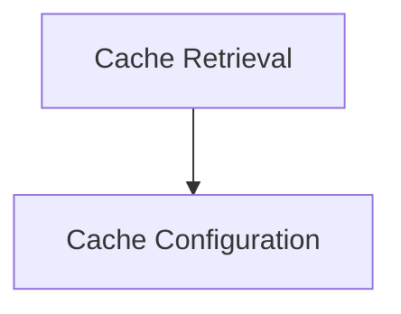

# Cache Initialization and Configuration

## Introduction
The `cache_initialization_and_configuration` module is responsible for setting up and managing the caching mechanisms within the DSPy client ecosystem. It provides functionalities to initialize the DSPy cache, configure its behavior (such as enabling/disabling disk or memory caching), and define parameters like cache directory and size limits. This module ensures efficient storage and retrieval of frequently accessed data, optimizing performance for DSPy applications.

## Architecture Overview
This module consists of two main components: cache configuration and cache retrieval. The cache configuration allows for detailed customization of how the cache operates, while cache retrieval handles the initial setup and provides a fallback mechanism in case of disk cache initialization failures.

<!-- DIAGRAM_JSON
{
    "direction": "TD",
    "nodes": [
        {"id": "cache_configuration", "label": "Cache Configuration", "type": "module", "link": "cache_configuration.md"},
        {"id": "cache_retrieval", "label": "Cache Retrieval", "type": "module", "link": "cache_retrieval.md"}
    ],
    "edges": [
        {"source": "cache_retrieval", "target": "cache_configuration"}
    ],
    "groups": []
}
-->

## Sub-modules

### [Cache Configuration](cache_configuration.md)
This sub-module focuses on the `configure_cache` function, allowing developers to set up the DSPy cache with specific parameters for disk and memory usage, directory paths, and size limitations.

### [Cache Retrieval](cache_retrieval.md)
This sub-module, primarily through the `_get_dspy_cache` function, is responsible for initializing and retrieving the DSPy cache instance. It includes a robust error handling mechanism to fall back to a memory-only cache if disk cache initialization encounters issues.
