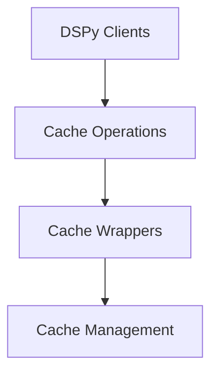

# Cache Wrappers Module (`cache_wrappers`)

## Introduction

The `cache_wrappers` module provides essential synchronous and asynchronous caching mechanisms for function calls within the DSPy framework. It intercepts function calls, checks for cached results based on the request, and either returns the cached value or executes the original function, caching its result for future use. This module is critical for optimizing performance by reducing redundant computations and API calls.

## Architecture

The `cache_wrappers` module is a core part of the `cache_operations` within the `dspy_clients` ecosystem. It relies on the `cache_management` module for cache configuration and retrieval.

<!-- DIAGRAM_JSON
{
    "direction": "TD",
    "nodes": [
        {"id": "dspy_clients", "label": "DSPy Clients", "type": "module", "link": "dspy_clients.md"},
        {"id": "cache_operations", "label": "Cache Operations", "type": "module", "link": "cache_operations.md"},
        {"id": "cache_wrappers", "label": "Cache Wrappers", "type": "module", "link": "cache_wrappers.md"},
        {"id": "cache_management", "label": "Cache Management", "type": "module", "link": "cache_management.md"}
    ],
    "edges": [
        {"source": "dspy_clients", "target": "cache_operations"},
        {"source": "cache_operations", "target": "cache_wrappers"},
        {"source": "cache_wrappers", "target": "cache_management"}
    ],
    "groups": []
}
-->

## Core Functionality

This module provides two primary wrapper functions for caching:

### `sync_wrapper`

The `sync_wrapper` component provides synchronous caching for functions. When a wrapped synchronous function is called, it first processes the request to create a cache key. It then attempts to retrieve a result from the global DSPy cache. If a cached result is found, it's returned immediately. Otherwise, the original function is executed, and its result is stored in the cache before being returned.

**Component ID:** `dspy.clients.cache.sync_wrapper`

### `async_wrapper`

Similar to `sync_wrapper`, the `async_wrapper` component offers asynchronous caching capabilities for `async` functions. It follows the same logic: processing the request, checking the cache, and either returning a cached result or awaiting the original asynchronous function's execution and then caching its result. This ensures efficient handling of asynchronous operations by avoiding redundant computations.

**Component ID:** `dspy.clients.cache.async_wrapper`