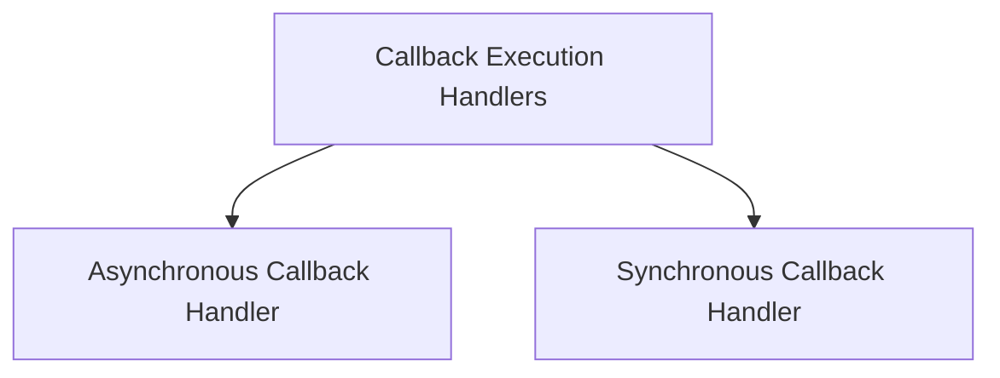

# Callback Execution Handlers

## Introduction

The `callback_execution_handlers` module provides utilities for managing and executing callbacks around function calls, supporting both synchronous and asynchronous operations. It ensures that registered callbacks are invoked at the start and end of a function's execution, handling `call_id` management and exceptions.

## Architecture Overview

The module is composed of two main handlers: one for asynchronous functions and another for synchronous functions. Both handlers follow a similar pattern of intercepting function calls, executing pre-call callbacks, invoking the main function, and then executing post-call callbacks, all while managing an active call ID.

<!-- DIAGRAM_JSON
{
    "direction": "TD",
    "nodes": [
        {"id": "asynchronous_callback_handler", "label": "Asynchronous Callback Handler", "type": "module", "link": "asynchronous_callback_handler.md"},
        {"id": "synchronous_callback_handler", "label": "Synchronous Callback Handler", "type": "module", "link": "synchronous_callback_handler.md"}
    ],
    "edges": [
        {"source": "callback_execution_handlers", "target": "asynchronous_callback_handler"},
        {"source": "callback_execution_handlers", "target": "synchronous_callback_handler"}
    ],
    "groups": []
}
-->

## Sub-modules

This module contains the following key sub-modules:

*   **[Asynchronous Callback Handler](asynchronous_callback_handler.md)**: Manages callbacks for asynchronous function executions.
*   **[Synchronous Callback Handler](synchronous_callback_handler.md)**: Manages callbacks for synchronous function executions.
