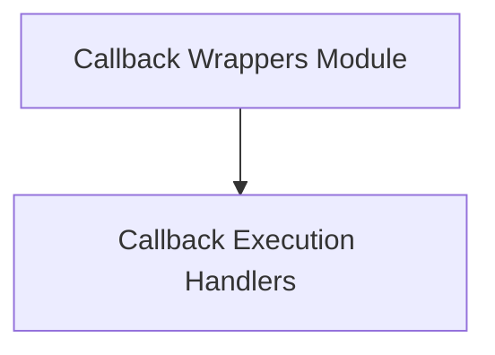

# Callback Wrappers Module

## Introduction and Purpose
The `callback_wrappers` module in `dspy.utils.callback` provides essential utilities for integrating synchronous and asynchronous callbacks into function execution. It ensures that predefined callback functions are executed at the start and end of wrapped functions, managing call contexts and error handling consistently across different execution models.

## Architecture Overview
This module is designed to provide a lightweight and flexible mechanism for interweaving custom logic (callbacks) into existing function flows without altering the core business logic. It consists of two primary wrappers: one for synchronous functions and another for asynchronous functions, both following a similar execution pattern.

<!-- DIAGRAM_JSON
{
    "direction": "TD",
    "nodes": [
        {"id": "callback_execution_handlers", "label": "Callback Execution Handlers", "type": "module", "link": "callback_execution_handlers.md"}
    ],
    "edges": [],
    "groups": []
}
-->

## High-Level Functionality

### Callback Execution Handlers
This sub-module, documented in [callback_execution_handlers.md](callback_execution_handlers.md), contains the core logic for wrapping functions and executing callbacks. It provides both `sync_wrapper` and `async_wrapper` to ensure that callbacks are properly triggered before and after the execution of the target function, handling active call IDs and exceptions. This ensures that the system can react to function invocations and completions in a structured and observable manner.
