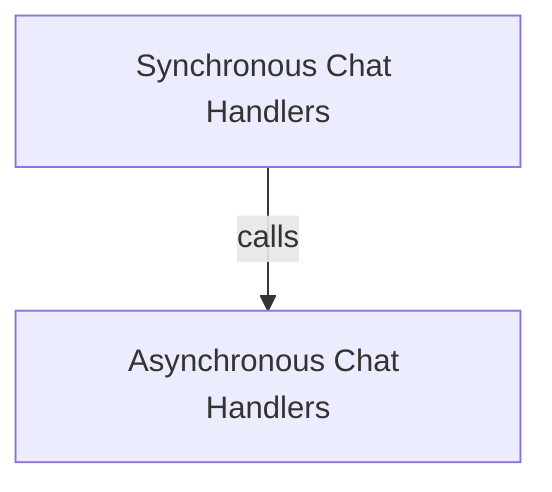

# Chat Completion Handlers Module

## Introduction

The `chat_completion_handlers` module is a crucial part of the `dspy.clients.lm` package, providing robust interfaces for interacting with LiteLLM for chat-based language model completions. It abstracts away the complexities of direct API calls, offering both synchronous and asynchronous methods, as well as handling streaming responses. This module is essential for applications requiring dynamic and efficient communication with various language models supported by LiteLLM.

## Architecture Overview

The `chat_completion_handlers` module is structured into two primary sub-modules, focusing on synchronous and asynchronous operations respectively. Both leverage LiteLLM's capabilities for chat completions and integrate with streaming functionalities. This clear separation ensures maintainability and allows developers to choose the appropriate handler based on their application's concurrency model.

<!-- DIAGRAM_JSON
{
    "direction": "TD",
    "nodes": [
        {"id": "synchronous_handlers", "label": "Synchronous Chat Handlers", "type": "module", "link": "synchronous_handlers.md"},
        {"id": "asynchronous_handlers", "label": "Asynchronous Chat Handlers", "type": "module", "link": "asynchronous_handlers.md"}
    ],
    "edges": [
        {"source": "synchronous_handlers", "target": "asynchronous_handlers", "label": "can operate independently"}
    ],
    "groups": []
}
-->

## Sub-modules

### [Synchronous Chat Handlers](synchronous_handlers.md)

This sub-module provides synchronous functions for handling chat completions and integrating with streaming responses via LiteLLM. It's suitable for applications where blocking calls are acceptable or preferred.

### [Asynchronous Chat Handlers](asynchronous_handlers.md)

This sub-module offers asynchronous counterparts for chat completions and streaming integrations, designed for non-blocking I/O operations to enhance performance and responsiveness in concurrent environments.
