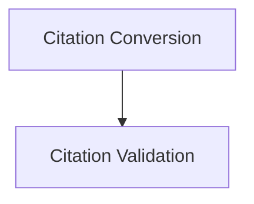

# Citation Handling Module

## Introduction

The `citation_handling` module, part of `dspy.adapters.types.citation`, is responsible for managing and standardizing citation data within the system. It provides functionalities for converting raw citation data into structured `Citations` objects, formatting these objects back into dictionary lists, and robustly validating various input formats for citations.

## Architecture Overview

This module is structured into two main sub-modules, each focusing on a specific aspect of citation management:

<!-- DIAGRAM_JSON
{
    "direction": "TD",
    "nodes": [
        {"id": "citation_conversion", "label": "Citation Conversion", "type": "module", "link": "citation_conversion.md"},
        {"id": "citation_validation", "label": "Citation Validation", "type": "module", "link": "citation_validation.md"}
    ],
    "edges": [
        {"source": "citation_conversion", "target": "citation_validation"}
    ],
    "groups": []
}
-->

## Sub-modules

### [Citation Conversion](citation_conversion.md)

This sub-module focuses on the bidirectional transformation of citation data. It includes utilities for creating `Citations` objects from lists of dictionaries and for converting these objects back into a standardized dictionary list format for external use or storage.

### [Citation Validation](citation_validation.md)

The `citation_validation` sub-module provides comprehensive methods to ensure the integrity and correct format of incoming citation data. It can handle various input structures, including `Citations` objects, lists of citation dictionaries, and single citation dictionaries, normalizing them into a consistent internal representation.