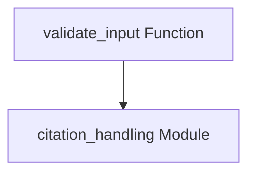

# citation_validation Module Documentation

## Introduction

The `citation_validation` module, part of the larger `dspy.adapters.types.citation` package, is responsible for ensuring the integrity and proper formatting of citation data within the DSPy framework. Its primary role is to validate various input formats for citations and convert them into a standardized structure, facilitating consistent handling of citation information across the system.

## Purpose and Core Functionality

The core functionality of this module revolves around the `validate_input` function. This function acts as a robust parser and validator for citation-related data, accepting different input types (single dictionaries, lists of dictionaries, or pre-existing `Citations` objects) and transforming them into a uniform internal representation. This ensures that any component expecting citation data receives it in a predictable and usable format, preventing common data inconsistencies.

## Architecture and Component Relationships

The `citation_validation` module is a leaf module within the `dspy_adapters.custom_types.citation_handling` hierarchy. It contains a single core component, `validate_input`, which relies on the `Citation` class (implicitly from `cls.Citation`) defined within the broader `citation_handling` module. This module's output (validated citation objects) is crucial for other parts of the `dspy_adapters` that process or display citation information.

<!-- DIAGRAM_JSON
{
    "direction": "TD",
    "nodes": [
        {"id": "validate_input", "label": "validate_input Function", "type": "component", "link": null},
        {"id": "citation_handling", "label": "citation_handling Module", "type": "external", "link": "citation_handling.md"}
    ],
    "edges": [
        {"source": "validate_input", "target": "citation_handling"}
    ],
    "groups": []
}
-->

### `validate_input(cls, data: Any)`

This function is the central piece of the `citation_validation` module. It performs the following checks and transformations:

*   **Existing `Citations` Object**: If the input `data` is already an instance of the `Citations` class, it is returned directly.
*   **List of Citation Dictionaries**: If `data` is a list where each item is a dictionary containing a `"cited_text"` key, it converts each dictionary into a `Citations.Citation` object and wraps them in a dictionary with a `"citations"` key.
*   **Single Citation Dictionary**: If `data` is a dictionary:
    *   If it contains a `"citations"` key (expected to be a list of dictionaries), it processes each item in that list into `Citations.Citation` objects.
    *   If it contains a `"cited_text"` key, it treats it as a single citation and wraps it in a dictionary under a `"citations"` key.
*   **Invalid Input**: For any other input format, it raises a `ValueError`.

#### Parameters

*   `cls`: The class itself (e.g., `Citations`). Used to instantiate `Citations.Citation` objects.
*   `data` (`Any`): The input data representing citation information. This can be an existing `Citations` object, a list of dictionaries, or a dictionary.

#### Returns

*   A dictionary with a `"citations"` key, containing a list of `Citations.Citation` objects, or the original `Citations` object if `data` was already one.

#### Raises

*   `ValueError`: If the input `data` does not conform to any of the expected citation formats.