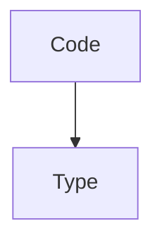

# Code Data Type Module

The `code_data_type` module defines the `Code` type within the DSPy framework, specifically designed for handling code as a structured data type. This module is crucial for applications involving code generation, analysis, and manipulation within DSPy programs.

## Core Functionality

The primary component of this module is the `dspy.adapters.types.code.Code` class, which extends the `Type` base class. It encapsulates code snippets, providing mechanisms for formatting, serialization, and input validation.

### `dspy.adapters.types.code.Code` Class

This class represents a block of code, typically as a string, and includes metadata such as the programming language.

**Attributes:**

*   `code`: A string field containing the code itself.
*   `language`: A class variable (ClassVar[str]) that defaults to "python", indicating the programming language of the code.

**Methods:**

*   `format()`: Returns the raw code string.
*   `serialize_model()`: Overrides the default Pydantic serialization to return the raw code string, bypassing custom type identifiers.
*   `description()`: Provides a string description of the `Code` type, detailing its expected format (markdown code block for output fields) and the specified programming language.

**Input Validation (`validate_input`):**

The `validate_input` class method handles various input formats for `dspy.Code`:

*   If the input is already an instance of `Code`, it's returned directly.
*   If the input is a string, it's treated as the `code` content after filtering.
*   If the input is a dictionary, it must contain a `code` field, which is then filtered and used.
*   Raises a `ValueError` for any other invalid input type or missing `code` field in a dictionary.

**Usage Examples:**

`dspy.Code` is highly versatile and can be used as both an input and output field in DSPy signatures.

**Example 1: `dspy.Code` as an output type in code generation**

```python
import dspy

dspy.configure(lm=dspy.LM("openai/gpt-4o-mini"))


class CodeGeneration(dspy.Signature):
    '''Generate python code to answer the question.'''

    question: str = dspy.InputField(description="The question to answer")
    code: dspy.Code["java"] = dspy.OutputField(description="The code to execute")


predict = dspy.Predict(CodeGeneration)

result = predict(question="Given an array, find if any of the two numbers sum up to 10")
print(result.code)
```

**Example 2: `dspy.Code` as an input type in code analysis**

```python
import dspy
import inspect

dspy.configure(lm=dspy.LM("openai/gpt-4o-mini"))

class CodeAnalysis(dspy.Signature):
    '''Analyze the time complexity of the function.'''

    code: dspy.Code["python"] = dspy.InputField(description="The function to analyze")
    result: str = dspy.OutputField(description="The time complexity of the function")


predict = dspy.Predict(CodeAnalysis)

def sleepsort(x):
    import time

    for i in x:
        time.sleep(i)
        print(i)

result = predict(code=inspect.getsource(sleepsort))
print(result.result)
```

## Architecture and Component Relationships

The `code_data_type` module centers around the `Code` class, which is a specialized data type within the broader DSPy adapters ecosystem.

<!-- DIAGRAM_JSON
{
    "direction": "TD",
    "nodes": [
        {"id": "code_type", "label": "Code", "type": "component", "link": null},
        {"id": "base_type", "label": "Type", "type": "external", "link": "base_type.md"}
    ],
    "edges": [
        {"source": "code_type", "target": "base_type"}
    ],
    "groups": []
}
-->



## System Integration

This module is a part of the `dspy_adapters.custom_types.structured_text_data` sub-module, providing a concrete implementation for handling code-related data. It integrates into the DSPy framework by offering a standardized way to represent and validate code within DSPy signatures and prediction programs. By inheriting from `base_type`, `dspy.Code` ensures consistency with other custom data types in DSPy, facilitating seamless interaction with language models for tasks that involve understanding or generating code.