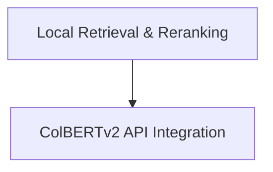

# ColBERTv2 Retrieval Module

## Introduction and Purpose

The `colbert_retrieval` module provides functionalities for integrating and utilizing the ColBERTv2 neural retrieval model. It offers both local implementations for building and searching ColBERTv2 indices, as well as a wrapper for interacting with a remote ColBERTv2 API endpoint. This module is essential for applications requiring efficient and high-quality document retrieval and reranking, often used in conjunction with large language models.

## Architecture Overview

The `colbert_retrieval` module is structured into two main sub-modules:

*   **[API Integration](api_integration.md)**: Handles communication with external ColBERTv2 services.
*   **[Local Retrieval & Reranking](local_retrieval_and_reranking.md)**: Manages local ColBERTv2 index creation, retrieval, and reranking.

These sub-modules work in tandem to provide flexible ColBERTv2 capabilities, allowing developers to choose between local processing and remote service integration based on their deployment needs.

<!-- DIAGRAM_JSON
{
    "direction": "TD",
    "nodes": [
        {"id": "api_integration", "label": "ColBERTv2 API Integration", "type": "module", "link": "api_integration.md"},
        {"id": "local_retrieval_and_reranking", "label": "Local Retrieval & Reranking", "type": "module", "link": "local_retrieval_and_reranking.md"}
    ],
    "edges": [
        {"source": "local_retrieval_and_reranking", "target": "api_integration"}
    ],
    "groups": []
}
-->

## Sub-modules

### [API Integration](api_integration.md)

This sub-module (`api_integration`) is responsible for facilitating communication with a ColBERTv2 API endpoint. It provides a `ColBERTv2` class that can send queries to a remote service and retrieve ranked passages, supporting both GET and POST request methods.

### [Local Retrieval & Reranking](local_retrieval_and_reranking.md)

The `local_retrieval_and_reranking` sub-module offers direct, local control over ColBERTv2 functionalities. It includes `ColBERTv2RetrieverLocal` for building and searching local ColBERTv2 indices and `ColBERTv2RerankerLocal` for reranking passages based on a given query using a local ColBERT model. This is ideal for environments where local index management and processing are preferred or required.