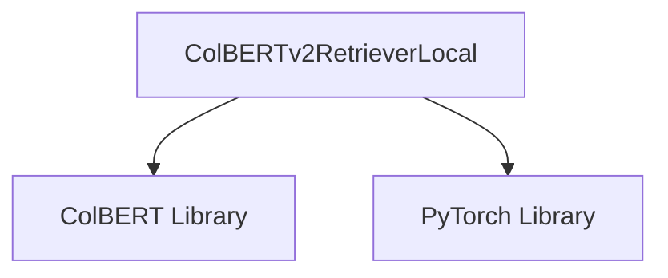

# colbert_retriever_local

The `colbert_retriever_local` module provides local retrieval capabilities using the ColBERTv2 model. It allows for building and searching an index over a collection of passages, facilitating efficient retrieval of relevant information.

## Core Functionality

The primary component of this module is `ColBERTv2RetrieverLocal`, which encapsulates the logic for creating and querying a local ColBERTv2 index.

### ColBERTv2RetrieverLocal

`ColBERTv2RetrieverLocal` is responsible for:

*   **Initialization**: Setting up the retriever with a list of passages and a `ColBERTConfig`.
*   **Index Building**: Constructing a ColBERTv2 index from the provided passages. This process involves using the `colbert` library's `Indexer` to create a searchable representation of the text.
*   **Index Loading**: Loading an existing ColBERTv2 index for querying.
*   **Passage Retrieval**: Performing a search against the indexed passages given a query, and optionally filtering results by passage IDs.

```python
class ColBERTv2RetrieverLocal:
    def __init__(self, passages: list[str], colbert_config=None, load_only: bool = False):
        # ... (initialization code)

    def build_index(self):
        # ... (index building code)

    def get_index(self):
        # ... (index loading code)

    def forward(self, query: str, k: int = 7, **kwargs):
        # ... (passage retrieval code)
```

#### `__init__(self, passages: list[str], colbert_config=None, load_only: bool = False)`

Initializes the ColBERTv2 retriever. It takes a list of passages, a `ColBERTConfig` object (which must include a checkpoint and an index name), and a `load_only` flag. If `load_only` is `False`, it will build the index; otherwise, it will load an existing one.

#### `build_index(self)`

Builds the ColBERTv2 index using the `colbert` library's `Indexer`. It requires the `colbert-ai` package to be installed. The index is built based on the `checkpoint`, `experiment`, and `index_name` specified in the `colbert_config`.

#### `get_index(self)`

Loads the ColBERTv2 index using the `colbert` library's `Searcher`. It retrieves the searcher object, enabling queries against the indexed passages.

#### `forward(self, query: str, k: int = 7, **kwargs)`

Executes a search query against the loaded ColBERTv2 index. It returns the top `k` most relevant passages along with their scores and original passage IDs. It also supports `filtered_pids` for restricting the search to a subset of passages.

## Architecture Diagram

<!-- DIAGRAM_JSON
{
    "direction": "TD",
    "nodes": [
        {"id": "colbert_v2_retriever_local", "label": "ColBERTv2RetrieverLocal", "type": "component", "link": null},
        {"id": "colbert_library", "label": "ColBERT Library", "type": "external", "link": null},
        {"id": "torch_library", "label": "PyTorch Library", "type": "external", "link": null}
    ],
    "edges": [
        {"source": "colbert_v2_retriever_local", "target": "colbert_library"},
        {"source": "colbert_v2_retriever_local", "target": "torch_library"}
    ],
    "groups": []
}
-->

