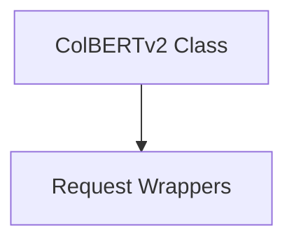

# colbertv2_client

The `colbertv2_client` module provides the `ColBERTv2` class, a Python wrapper for interacting with a ColBERTv2 retrieval service. It enables efficient semantic search by sending queries to a running ColBERTv2 instance and retrieving relevant documents.

## Core Functionality

### `ColBERTv2` Class

The `ColBERTv2` class serves as the primary interface for making retrieval requests to a ColBERTv2 server.

#### Initialization

```python
ColBERTv2(url: str = "http://0.0.0.0", port: str | int | None = None, post_requests: bool = False)
```

-   `url` (str): The base URL of the ColBERTv2 server. Defaults to "http://0.0.0.0".
-   `port` (str | int | None): The port number of the ColBERTv2 server. If provided, it will be appended to the `url`.
-   `post_requests` (bool): If `True`, POST requests will be used for retrieval. Otherwise, GET requests are used. Defaults to `False`.

#### Retrieval Method (`__call__`)

```python
__call__(query: str, k: int = 10, simplify: bool = False) -> list[str] | list[dotdict]
```

This method executes a retrieval query against the ColBERTv2 server.

-   `query` (str): The search query string.
-   `k` (int): The number of top-k documents to retrieve. Defaults to 10.
-   `simplify` (bool): If `True`, the method returns a list of strings containing only the `long_text` from the retrieved passages. If `False`, it returns a list of `dotdict` objects representing the full passage information. Defaults to `False`.

## Architecture and Component Relationships

The `colbertv2_client` module, primarily through its `ColBERTv2` class, acts as a client to a ColBERTv2 retrieval service. It leverages internal request handling utilities to communicate with the ColBERTv2 endpoint.

<!-- DIAGRAM_JSON
{
    "direction": "TD",
    "nodes": [
        {"id": "colbertv2_class", "label": "ColBERTv2 Class", "type": "component", "link": null},
        {"id": "request_wrappers", "label": "Request Wrappers", "type": "external", "link": "request_wrappers.md"}
    ],
    "edges": [
        {"source": "colbertv2_class", "target": "request_wrappers"}
    ],
    "groups": []
}
-->


The `ColBERTv2` class (labeled "ColBERTv2 Class" in the diagram) is the core component of this module. It depends on the [request_wrappers](request_wrappers.md) module for executing the actual HTTP GET or POST requests to the ColBERTv2 server. Specifically, it utilizes functions like `colbertv2_get_request` and `colbertv2_post_request` (which are part of the `request_wrappers` module) to interact with the external ColBERTv2 service.

## How the Module Fits into the Overall System

The `colbertv2_client` module is a specialized client within the `dspy.dsp.colbertv2` ecosystem, providing the means to interact with a deployed ColBERTv2 retrieval system. It enables other modules or user programs to easily integrate ColBERTv2 for tasks requiring semantic search or document retrieval. It abstracts away the HTTP request details, offering a simple Python interface for querying the retrieval service. This module is part of the larger [colbert_retrieval](colbert_retrieval.md) module, which focuses on all aspects of ColBERTv2 integration.