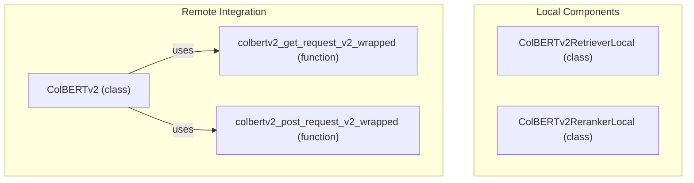

# colbertv2_integration
This module provides local ColBERTv2 retrieval and reranking capabilities, alongside a wrapper for interacting with a remote ColBERTv2 service via HTTP requests.

<!-- DIAGRAM_JSON
{
  "nodes": [
    {
      "id": "ColBERTv2RetrieverLocal",
      "label": "ColBERTv2RetrieverLocal",
      "type": "class"
    },
    {
      "id": "colbertv2_get_request_v2_wrapped",
      "label": "colbertv2_get_request_v2_wrapped",
      "type": "function"
    },
    {
      "id": "colbertv2_post_request_v2_wrapped",
      "label": "colbertv2_post_request_v2_wrapped",
      "type": "function"
    },
    {
      "id": "ColBERTv2RerankerLocal",
      "label": "ColBERTv2RerankerLocal",
      "type": "class"
    },
    {
      "id": "ColBERTv2",
      "label": "ColBERTv2",
      "type": "class"
    }
  ],
  "edges": [
    {
      "source": "ColBERTv2",
      "target": "colbertv2_get_request_v2_wrapped",
      "label": "uses"
    },
    {
      "source": "ColBERTv2",
      "target": "colbertv2_post_request_v2_wrapped",
      "label": "uses"
    }
  ],
  "groups": [
    {
      "id": "Local Components",
      "label": "Local Components",
      "nodes": [
        "ColBERTv2RetrieverLocal",
        "ColBERTv2RerankerLocal"
      ]
    },
    {
      "id": "Remote Integration",
      "label": "Remote Integration",
      "nodes": [
        "ColBERTv2",
        "colbertv2_get_request_v2_wrapped",
        "colbertv2_post_request_v2_wrapped"
      ]
    }
  ]
}
-->
