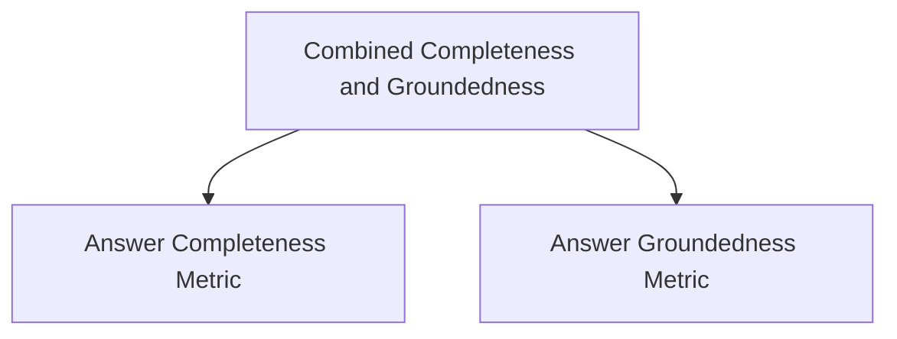

# Completeness Groundedness Module

## Introduction

The `completeness_groundedness` module provides a comprehensive approach to evaluating the quality of system responses by focusing on two critical aspects: **answer completeness** and **answer groundedness**. It offers metrics and components to programmatically assess whether a system's response fully addresses the question based on ground truth and whether its claims are adequately supported by retrieved context.

This module is part of the `dspy.evaluate.auto_evaluation` package, designed to facilitate automated evaluation of language model outputs.

## Architecture

The module is structured to combine individual completeness and groundedness assessments into a unified score, offering a holistic view of response quality.

<!-- DIAGRAM_JSON
{
    "direction": "TD",
    "nodes": [
        {"id": "completeness_groundedness_combined", "label": "Combined Completeness and Groundedness", "type": "module", "link": "completeness_groundedness_combined.md"},
        {"id": "answer_completeness_metric", "label": "Answer Completeness Metric", "type": "module", "link": "answer_completeness_metric.md"},
        {"id": "answer_groundedness_metric", "label": "Answer Groundedness Metric", "type": "module", "link": "answer_groundedness_metric.md"}
    ],
    "edges": [
        {"source": "completeness_groundedness_combined", "target": "answer_completeness_metric"},
        {"source": "completeness_groundedness_combined", "target": "answer_groundedness_metric"}
    ],
    "groups": []
}
-->

## Sub-modules and Functionality

This module comprises the following key sub-modules:

### [Combined Completeness and Groundedness](completeness_groundedness_combined.md)
This sub-module (`completeness_groundedness_combined`) integrates the scores from answer completeness and groundedness to provide a single, aggregated evaluation metric. It is designed to give a balanced assessment of a system's response quality.

### [Answer Completeness Metric](answer_completeness_metric.md)
The `answer_completeness_metric` sub-module focuses on determining how thoroughly a system's response covers the key ideas present in the ground truth. It involves enumerating key ideas from both the ground truth and the system response, discussing their overlap, and calculating a completeness score.

### [Answer Groundedness Metric](answer_groundedness_metric.md)
The `answer_groundedness_metric` sub-module evaluates the extent to which claims made in a system's response are supported by the provided `retrieved_context` and basic common sense. It identifies check-worthy claims in the system response, discusses their support from the context, and calculates a groundedness score.
