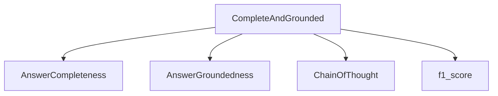

# completeness_groundedness_combined

## Introduction
The `completeness_groundedness_combined` module provides a unified metric for evaluating the quality of language model responses by combining two crucial aspects: answer completeness and groundedness. This module offers the `CompleteAndGrounded` class, which serves as an automated metric to assess how well a generated response addresses the user's question and whether it is supported by the provided context.

## Architecture and Component Relationships

The `completeness_groundedness_combined` module primarily consists of the `CompleteAndGrounded` class. This class orchestrates the evaluation process by leveraging other specialized modules for individual completeness and groundedness assessments.

<!-- DIAGRAM_JSON
{
    "direction": "TD",
    "nodes": [
        {"id": "complete_and_grounded", "label": "CompleteAndGrounded", "type": "component", "link": null},
        {"id": "answer_completeness", "label": "AnswerCompleteness", "type": "external", "link": "completeness_groundedness.md"},
        {"id": "answer_groundedness", "label": "AnswerGroundedness", "type": "external", "link": "completeness_groundedness.md"},
        {"id": "chain_of_thought", "label": "ChainOfThought", "type": "external", "link": "dspy_prediction_strategies.md"},
        {"id": "f1_score_metric", "label": "f1_score", "type": "external", "link": "traditional_metrics.md"}
    ],
    "edges": [
        {"source": "complete_and_grounded", "target": "answer_completeness"},
        {"source": "complete_and_grounded", "target": "answer_groundedness"},
        {"source": "complete_and_grounded", "target": "chain_of_thought"},
        {"source": "complete_and_grounded", "target": "f1_score_metric"}
    ],
    "groups": []
}
-->

### Component Breakdown

*   **`CompleteAndGrounded`**: This is the main class within the module. It initializes instances of `AnswerCompleteness` and `AnswerGroundedness` (both wrapped with `ChainOfThought`) and then combines their individual scores using an F1 score calculation. It provides a `forward` method to perform the combined evaluation given an example, a prediction, and an optional trace.

### External Dependencies

*   **`AnswerCompleteness`**: (Refer to [completeness_groundedness.md](completeness_groundedness.md)) - Used by `CompleteAndGrounded` to assess how comprehensively a system's response addresses the given question.
*   **`AnswerGroundedness`**: (Refer to [completeness_groundedness.md](completeness_groundedness.md)) - Used by `CompleteAndGrounded` to evaluate whether the system's response is factually supported by the provided retrieved context.
*   **`ChainOfThought`**: (Refer to [dspy_prediction_strategies.md](dspy_prediction_strategies.md)) - A DSPy module that enhances the reasoning capabilities of a language model by breaking down complex tasks into intermediate steps. It's used here to wrap `AnswerCompleteness` and `AnswerGroundedness` for more robust evaluation.
*   **`f1_score`**: (Refer to [traditional_metrics.md](traditional_metrics.md)) - A common metric used to combine precision and recall, applied here to aggregate the completeness and groundedness scores.

## How the Module Fits into the Overall System

The `completeness_groundedness_combined` module is a vital part of the [dspy_evaluation](dspy_evaluation.md) package, specifically under the [auto_metrics](auto_metrics.md) and [completeness_groundedness](completeness_groundedness.md) sub-modules. It provides an automated, holistic metric for evaluating the quality of language model outputs, moving beyond simple keyword matching to assess semantic understanding and factual support.

It plays a crucial role in:
*   **Automated Metric Generation**: Offering a single, comprehensive score for response quality.
*   **Program Optimization**: Allowing DSPy optimizers to tune language model programs for better completeness and groundedness.
*   **Developer Feedback**: Providing clear, interpretable feedback on where a model's response might be lacking (either in fully addressing the question or in being supported by evidence).

By integrating `AnswerCompleteness` and `AnswerGroundedness`, this module ensures that evaluated responses are not only thorough but also factually sound, contributing to the development of more reliable and trustworthy AI systems.