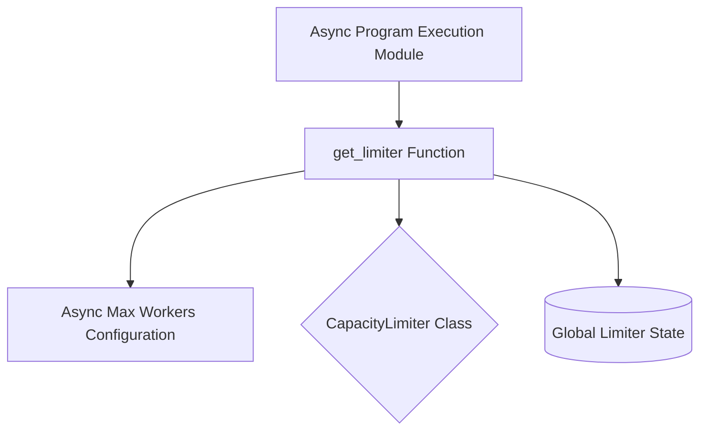

# Concurrency Management Module

The `concurrency_management` module is responsible for managing and enforcing limits on the number of concurrent asynchronous operations within the DSPy framework. It provides a centralized mechanism to control resource usage and prevent overloading external services or the system itself.

## Core Functionality

The primary function of this module is to provide a `CapacityLimiter` instance that can be used across various asynchronous components of DSPy. This limiter ensures that a specified maximum number of asynchronous tasks can run simultaneously.

### Components

#### `dspy.utils.asyncify.get_limiter`

```python
def get_limiter():
    async_max_workers = get_async_max_workers()

    global _limiter
    if _limiter is None:
        _limiter = CapacityLimiter(async_max_workers)
    elif _limiter.total_tokens != async_max_workers:
        _limiter.total_tokens = async_max_workers

    return _limiter
```

This function retrieves or initializes a global `CapacityLimiter` instance. It checks the current `async_max_workers` configuration and updates the limiter's capacity if it has changed. This ensures that the concurrency limits are always up-to-date with the system's configuration.

## Architecture and Component Relationships

The `concurrency_management` module, specifically the `get_limiter` function, acts as a singleton provider for the `CapacityLimiter`. It configures this limiter based on the `async_max_workers` setting, which is retrieved from another configuration source (e.g., a global settings module).

Other asynchronous modules, such as those responsible for executing asynchronous programs, depend on `get_limiter` to acquire the necessary concurrency control. This centralizes the management of concurrent tasks, making the system more robust and easier to maintain.

<!-- DIAGRAM_JSON
{
    "direction": "TD",
    "nodes": [
        {"id": "get_limiter_func", "label": "get_limiter Function", "type": "component", "link": null},
        {"id": "async_max_workers", "label": "Async Max Workers Configuration", "type": "component", "link": null},
        {"id": "capacity_limiter_cls", "label": "CapacityLimiter Class", "type": "external", "link": null},
        {"id": "global_limiter_state", "label": "Global Limiter State", "type": "component", "link": null},
        {"id": "async_program_exec", "label": "Async Program Execution Module", "type": "external", "link": "async_program_execution.md"}
    ],
    "edges": [
        {"source": "get_limiter_func", "target": "async_max_workers"},
        {"source": "get_limiter_func", "target": "capacity_limiter_cls"},
        {"source": "get_limiter_func", "target": "global_limiter_state"},
        {"source": "async_program_exec", "target": "get_limiter_func"}
    ],
    "groups": []
}
-->



## How it Fits into the Overall System

The `concurrency_management` module is a fundamental utility within the `dspy_utilities.asynchronization_utilities` suite. It provides a critical piece of infrastructure for managing the execution flow of asynchronous programs throughout the DSPy framework. Specifically, modules like [async_program_execution](async_program_execution.md) rely on this module to obtain and utilize the `CapacityLimiter` to manage the concurrent execution of tasks, ensuring system stability and efficient resource utilization.

This module abstracts away the complexities of concurrency control, allowing other modules to simply request a limiter without needing to manage its initialization or configuration details. This promotes a cleaner architecture and reduces the likelihood of race conditions or resource contention in asynchronous operations.