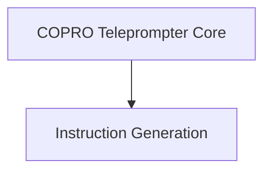

# CoPro Optimizer Module

## Introduction
The `copro_optimizer` module in DSPy implements the COPRO (Code-Optimized Prompting) teleprompter, a method for automatically optimizing prompts for large language models. This module focuses on iteratively refining the instructions and output field prefixes of DSPy programs to improve their performance on a given task.

## Architecture Overview

<!-- DIAGRAM_JSON
{
    "direction": "TD",
    "nodes": [
        {"id": "copro_core", "label": "COPRO Teleprompter Core", "type": "module", "link": "copro_core.md"},
        {"id": "instruction_generation", "label": "Instruction Generation", "type": "module", "link": "instruction_generation.md"}
    ],
    "edges": [
        {"source": "copro_core", "target": "instruction_generation"}
    ],
    "groups": []
}
-->

The `copro_optimizer` module is structured around two main components:

### Sub-modules

*   **[COPRO Teleprompter Core](copro_core.md)**: This sub-module contains the core `COPRO` class, which orchestrates the prompt optimization process. It manages candidate prompt instructions, evaluates their performance, and iteratively refines them.

*   **[Instruction Generation](instruction_generation.md)**: This sub-module defines the DSPy `Signature`s used by the `COPRO` teleprompter to generate initial prompt instructions (`BasicGenerateInstruction`) and to propose new instructions based on previous attempts and scores (`GenerateInstructionGivenAttempts`).

## How it Fits into the Overall System
The `copro_optimizer` module is a key component within the `dspy.teleprompting_optimizers` package, providing an advanced strategy for automatically improving the performance of DSPy programs by optimizing their underlying prompts. It leverages the power of language models to self-improve instruction following, making DSPy programs more robust and effective. It interacts with other DSPy components such as `dspy.primitives.module.Module` for program representation and `dspy.evaluate.Evaluate` for scoring candidate prompts.