## Core Prediction Modules
This module implements advanced prediction strategies such as BestOfN for repeated execution and selection, Refine for iterative improvement with feedback, ReAct for reasoning and tool use, ProgramOfThought for code generation and execution, CodeAct for combined code and tool-based reasoning, and RLM for recursive language model interaction via a REPL.

<!-- DIAGRAM_JSON
{
    "direction": "TD",
    "nodes": [
        {"id": "best_of_n", "label": "BestOfN (Repeated Execution)", "type": "component", "link": null},
        {"id": "refine", "label": "Refine (Execution with Feedback)", "type": "component", "link": null},
        {"id": "react", "label": "ReAct (Reasoning and Acting)", "type": "component", "link": null},
        {"id": "program_of_thought", "label": "ProgramOfThought (Code Execution)", "type": "component", "link": null},
        {"id": "code_act", "label": "CodeAct (Code Execution and Tools)", "type": "component", "link": null},
        {"id": "rlm", "label": "RLM (Recursive Language Model)", "type": "component", "link": null},

        {"id": "base_modules", "label": "Base Modules", "type": "external", "link": "base_modules.md"},
        {"id": "lm_clients", "label": "LM Clients", "type": "external", "link": "lm_clients.md"},
        {"id": "aggregation_and_feedback", "label": "Aggregation and Feedback", "type": "external", "link": "aggregation_and_feedback.md"},
        {"id": "signatures_and_fields", "label": "Signatures and Fields", "type": "external", "link": "signatures_and_fields.md"},
        {"id": "general_utilities", "label": "General Utilities", "type": "external", "link": "general_utilities.md"},
        {"id": "type_system", "label": "Type System", "type": "external", "link": "type_system.md"}
    ],
    "edges": [
        {"source": "best_of_n", "target": "base_modules", "label": "inherits from"},
        {"source": "best_of_n", "target": "lm_clients", "label": "uses"},
        {"source": "best_of_n", "target": "aggregation_and_feedback", "label": "evaluates with"},

        {"source": "refine", "target": "base_modules", "label": "inherits from"},
        {"source": "refine", "target": "lm_clients", "label": "uses"},
        {"source": "refine", "target": "aggregation_and_feedback", "label": "evaluates with"},
        {"source": "refine", "target": "signatures_and_fields", "label": "defines with"},
        {"source": "refine", "target": "general_utilities", "label": "adapts with"},

        {"source": "react", "target": "base_modules", "label": "inherits from"},
        {"source": "react", "target": "signatures_and_fields", "label": "defines with"},
        {"source": "react", "target": "type_system", "label": "uses"},
        {"source": "react", "target": "general_utilities", "label": "adapts with"},

        {"source": "program_of_thought", "target": "base_modules", "label": "inherits from"},
        {"source": "program_of_thought", "target": "signatures_and_fields", "label": "defines with"},
        {"source": "program_of_thought", "target": "lm_clients", "label": "predicts with"},
        {"source": "program_of_thought", "target": "general_utilities", "label": "executes with"},

        {"source": "code_act", "target": "react", "label": "inherits from"},
        {"source": "code_act", "target": "program_of_thought", "label": "inherits from"},
        {"source": "code_act", "target": "signatures_and_fields", "label": "defines with"},
        {"source": "code_act", "target": "type_system", "label": "uses"},
        {"source": "code_act", "target": "general_utilities", "label": "executes with"},

        {"source": "rlm", "target": "base_modules", "label": "inherits from"},
        {"source": "rlm", "target": "signatures_and_fields", "label": "defines with"},
        {"source": "rlm", "target": "lm_clients", "label": "queries with"},
        {"source": "rlm", "target": "type_system", "label": "uses"},
        {"source": "rlm", "target": "general_utilities", "label": "executes with"}
    ],
    "groups": [
        {"id": "prediction_strategies_grp", "label": "Prediction Strategies", "role": "generative", "nodes": ["best_of_n", "refine", "react", "program_of_thought", "code_act", "rlm"]}
    ]
}
-->

```mermaid
flowchart TD
    subgraph prediction_strategies_grp["Prediction Strategies"]
        best_of_n["BestOfN (Repeated Execution)"]
        refine["Refine (Execution with Feedback)"]
        react["ReAct (Reasoning and Acting)"]
        program_of_thought["ProgramOfThought (Code Execution)"]
        code_act["CodeAct (Code Execution and Tools)"]
        rlm["RLM (Recursive Language Model)"]
    end

    base_modules["Base Modules"]:::external
    lm_clients["LM Clients"]:::external
    aggregation_and_feedback["Aggregation and Feedback"]:::external
    signatures_and_fields["Signatures and Fields"]:::external
    general_utilities["General Utilities"]:::external
    type_system["Type System"]:::external

    best_of_n -->|"inherits from"| base_modules
    best_of_n -->|"uses"| lm_clients
    best_of_n -->|"evaluates with"| aggregation_and_feedback

    refine -->|"inherits from"| base_modules
    refine -->|"uses"| lm_clients
    refine -->|"evaluates with"| aggregation_and_feedback
    refine -->|"defines with"| signatures_and_fields
    refine -->|"adapts with"| general_utilities

    react -->|"inherits from"| base_modules
    react -->|"defines with"| signatures_and_fields
    react -->|"uses"| type_system
    react -->|"adapts with"| general_utilities

    program_of_thought -->|"inherits from"| base_modules
    program_of_thought -->|"defines with"| signatures_and_fields
    program_of_thought -->|"predicts with"| lm_clients
    program_of_thought -->|"executes with"| general_utilities

    code_act -->|"inherits from"| react
    code_act -->|"inherits from"| program_of_thought
    code_act -->|"defines with"| signatures_and_fields
    code_act -->|"uses"| type_system
    code_act -->|"executes with"| general_utilities

    rlm -->|"inherits from"| base_modules
    rlm -->|"defines with"| signatures_and_fields
    rlm -->|"queries with"| lm_clients
    rlm -->|"uses"| type_system
    rlm -->|"executes with"| general_utilities

    classDef generative fill:#fed7aa,stroke:#ea580c,stroke-width:1px,color:#7c2d12
    classDef analytical fill:#ede9fe,stroke:#8b5cf6,stroke-width:1px,color:#4c1d95

    class best_of_n,refine,react,program_of_thought,code_act,rlm generative
    class base_modules,lm_clients,aggregation_and_feedback,signatures_and_fields,general_utilities,type_system analytical

    click base_modules "base_modules.md" "View Base Modules"
    click lm_clients "lm_clients.md" "View LM Clients"
    click aggregation_and_feedback "aggregation_and_feedback.md" "View Aggregation and Feedback"
    click signatures_and_fields "signatures_and_fields.md" "View Signatures and Fields"
    click general_utilities "general_utilities.md" "View General Utilities"
    click type_system "type_system.md" "View Type System"
```
