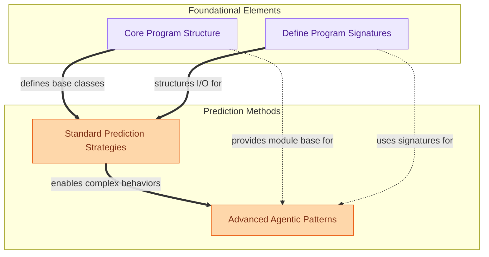

The `core_program_building` module is the heart of DSPy, providing the fundamental abstractions and strategies for constructing, executing, and optimizing language model programs. It empowers users to define modular, composable programs, specify their input/output behavior, and apply various prediction and agentic strategies to achieve robust and efficient results.

### How it Works

The module's components work together to enable a structured approach to building LLM applications:

1.  **Foundational Elements**: The `Core Program Structure` defines the base classes (`BaseModule`, `Module`) that all DSPy programs and predictors inherit from, providing a consistent interface for parameter management and execution. Alongside this, `Define Program Signatures` establishes the schema for inputs and outputs, ensuring structured communication with language models.
2.  **Prediction Methods**: Building on these foundations, `Standard Prediction Strategies` offer a range of techniques (e.g., BestOfN, ReAct, ProgramOfThought, Refine) to guide the language model's reasoning and output generation. These strategies leverage the core module structure and signatures to implement their logic.
3.  **Advanced Agentic Patterns**: For more complex, multi-step tasks, `Advanced Agentic Patterns` provide sophisticated frameworks like the `Avatar` agent and `Multi-Chain Comparison`, which orchestrate multiple prediction steps, tool use, and iterative refinement, often building upon the standard prediction strategies.

### Core Components

*   **`dspy.primitives.base_module.BaseModule`**: The abstract base class for all DSPy modules, providing core functionalities.
*   **`dspy.primitives.module.Module`**: The concrete base class for building composable DSPy programs.
*   **`dspy.signatures.signature.SignatureMeta`**: Metaclass for dynamically creating and validating DSPy signatures.
*   **`dspy.signatures.field.OldInputField`**: Defines an input field within a DSPy signature.
*   **`dspy.predict.best_of_n.BestOfN`**: A prediction strategy that selects the best output from N attempts.
*   **`dspy.predict.react.ReAct`**: Implements the ReAct (Reasoning and Acting) agentic strategy.
*   **`dspy.predict.refine.Refine`**: A module for iteratively refining predictions based on feedback.
*   **`dspy.predict.avatar.avatar.Avatar`**: An agentic framework for complex, iterative tasks with tool use.
*   **`dspy.predict.multi_chain_comparison.MultiChainComparison`**: Compares and aggregates outputs from multiple prediction chains.