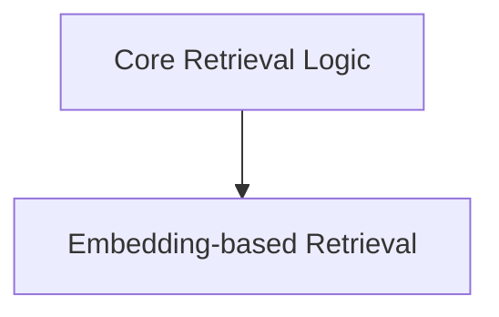

# Core Retrieval Module

The `core_retrieval` module provides fundamental functionalities for retrieving relevant passages from a corpus based on a given query. It serves as the backbone for various retrieval-augmented generation (RAG) applications within the DSPy framework, enabling efficient information lookup and integration. This module is a child of the `dspy_retrievers` module and works in conjunction with various Retriever Managers (RMs) defined elsewhere in the system.

## Architecture Overview

The `core_retrieval` module is composed of two primary sub-modules: `retrieval_logic` and `embedding_retrieval`. The `retrieval_logic` handles the basic search and result formatting, while `embedding_retrieval` extends this by incorporating similarity scores.

<!-- DIAGRAM_JSON
{
    "direction": "TD",
    "nodes": [
        {"id": "retrieval_logic", "label": "Core Retrieval Logic", "type": "module", "link": "retrieval_logic.md"},
        {"id": "embedding_retrieval", "label": "Embedding-based Retrieval", "type": "module", "link": "embedding_retrieval.md"}
    ],
    "edges": [
        {"source": "retrieval_logic", "target": "embedding_retrieval"}
    ],
    "groups": []
}
-->

## Sub-modules

### [Core Retrieval Logic](retrieval_logic.md)
This sub-module encapsulates the core mechanics of querying a Retriever Manager (RM) and transforming the raw results into a standardized `Prediction` object. It includes the `Retrieve` class, which acts as a callable search interface, and the `single_query_passage` utility for handling and formatting retrieved passages.

### [Embedding-based Retrieval](embedding_retrieval.md)
Building upon the core retrieval capabilities, this sub-module introduces functionality for retrieving passages along with their associated similarity scores and indices. The `EmbeddingsWithScores` class is designed for scenarios where the confidence or relevance score of retrieved passages is crucial for downstream processing, such as re-ranking or filtering.
