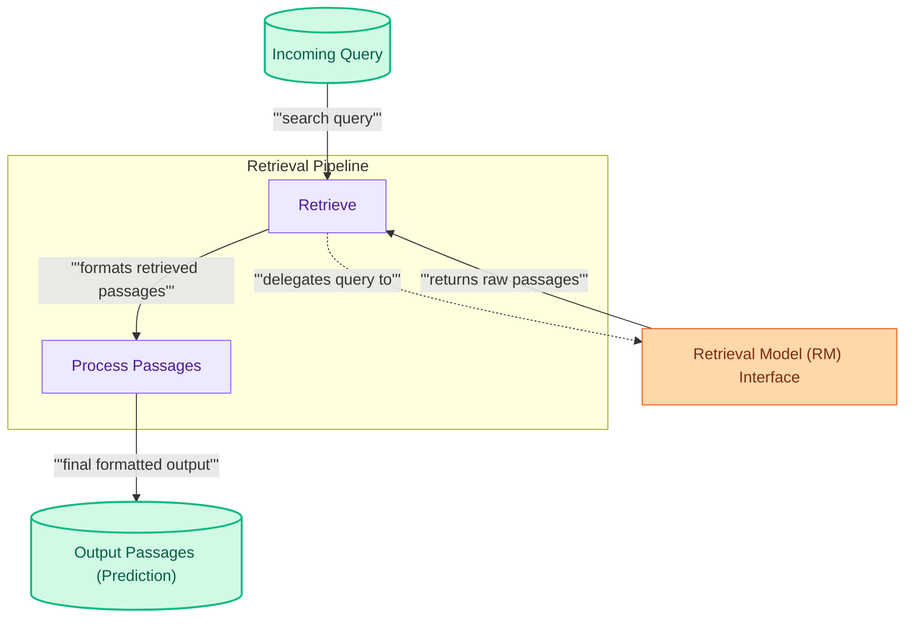

# Core Retrieval Mechanics

This module defines the fundamental components for querying a configured Retrieval Model (RM) to fetch relevant passages from a corpus, handling the input query and formatting the retrieved results.

<!-- DIAGRAM_JSON
{
    "direction": "TD",
    "nodes": [
        {"id": "query_input", "label": "Incoming Query", "type": "data", "link": null},
        {"id": "retrieve_module", "label": "Retrieve", "type": "component", "link": null},
        {"id": "rm_interface", "label": "Retrieval Model (RM) Interface", "type": "external", "link": "retrievers.md"},
        {"id": "process_passages", "label": "Process Passages", "type": "component", "link": null},
        {"id": "output_passages", "label": "Output Passages (Prediction)", "type": "data", "link": null}
    ],
    "edges": [
        {"source": "query_input", "target": "retrieve_module", "label": "search query"},
        {"source": "retrieve_module", "target": "rm_interface", "label": "delegates query to", "type": "dashed"},
        {"source": "rm_interface", "target": "retrieve_module", "label": "returns raw passages"},
        {"source": "retrieve_module", "target": "process_passages", "label": "formats retrieved passages"},
        {"source": "process_passages", "target": "output_passages", "label": "final formatted output"}
    ],
    "groups": [
        {"id": "retrieval_flow", "label": "Retrieval Pipeline", "role": "analytical", "nodes": ["retrieve_module", "process_passages"]}
    ]
}
-->

