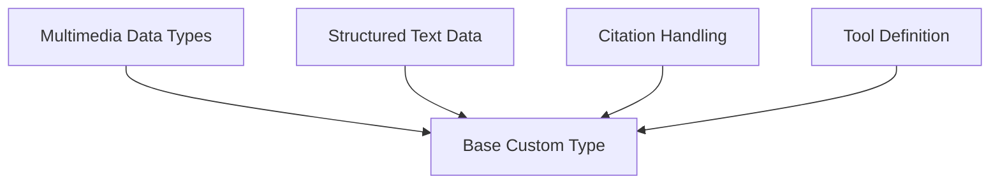

# Custom Types Module

The `custom_types` module in DSPy provides a flexible framework for defining and handling various custom data types that can be used within DSPy signatures. This allows for rich, structured inputs and outputs when interacting with Language Models (LLMs), moving beyond simple text strings to incorporate complex data like images, audio, code, documents, citations, and tool definitions.

## Architecture Overview

The `custom_types` module is built upon a `BaseType` class, which serves as the foundation for all other custom types. Specialized sub-modules then extend this base to handle specific data formats and functionalities, such as multimedia, structured text, citation management, and tool definitions. This modular design ensures extensibility and clear separation of concerns, allowing DSPy to support a wide array of data types for diverse LLM applications.

<!-- DIAGRAM_JSON
{
    "direction": "TD",
    "nodes": [
        {"id": "base_type", "label": "Base Custom Type", "type": "module", "link": "base_type.md"},
        {"id": "multimedia_data_types", "label": "Multimedia Data Types", "type": "module", "link": "multimedia_data_types.md"},
        {"id": "structured_text_data", "label": "Structured Text Data", "type": "module", "link": "structured_text_data.md"},
        {"id": "citation_handling", "label": "Citation Handling", "type": "module", "link": "citation_handling.md"},
        {"id": "tool_definition", "label": "Tool Definition", "type": "module", "link": "tool_definition.md"}
    ],
    "edges": [
        {"source": "multimedia_data_types", "target": "base_type"},
        {"source": "structured_text_data", "target": "base_type"},
        {"source": "citation_handling", "target": "base_type"},
        {"source": "tool_definition", "target": "base_type"}
    ],
    "groups": []
}
-->

## Sub-modules

### [Base Custom Type](base_type.md)
Provides the fundamental `Type` class from which all other custom types inherit, establishing a common interface for formatting and serialization within DSPy.

### [Multimedia Data Types](multimedia_data_types.md)
Encompasses custom types for handling diverse multimedia content, including `Audio`, `Image`, and `File` types, along with utility functions for format detection and encoding.

### [Structured Text Data](structured_text_data.md)
Includes custom types for specialized text formats such as `Code` and `Document`, enabling structured representation and interaction with LLMs for tasks like code generation and document-based QA.

### [Citation Handling](citation_handling.md)
Manages the creation, formatting, and validation of `Citations` objects, supporting the integration of verifiable information from external sources into LLM responses.

### [Tool Definition](tool_definition.md)
Offers the `Tool` class for defining and validating function-calling tools, allowing LLMs to interact with external systems and execute specific actions. This module streamlines the process of integrating external functionalities into DSPy programs.
