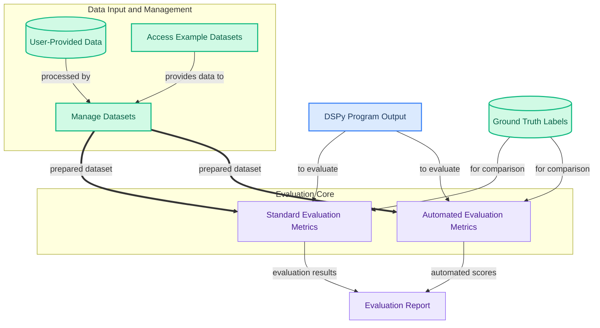

The `data_and_evaluation` module is dedicated to providing robust tools for managing datasets and comprehensively evaluating DSPy programs. It offers functionalities for loading, preparing, and accessing various datasets, alongside a rich set of metrics and automated evaluation strategies to assess program performance, completeness, and groundedness. This module is crucial for developing, testing, and optimizing DSPy applications by ensuring reliable data handling and rigorous performance assessment.

### How the Module's Components Work Together

The `data_and_evaluation` module orchestrates the flow from raw data to comprehensive evaluation reports. It starts by allowing users to manage and load datasets, either from their own sources or by utilizing pre-defined example datasets. These prepared datasets then serve as input for various evaluation mechanisms. Both standard, rule-based metrics and advanced, LLM-powered automatic evaluation methods consume the DSPy program's output and ground truth labels to generate detailed performance insights.

### Core Components Documentation

*   **Dataset Management**: Provides core functionalities for creating, loading, and splitting datasets from various sources.
    *   `dspy.datasets.dataloader.DataLoader`
    *   `dspy.datasets.dataset.Dataset`
*   **Example Datasets**: Offers a collection of common datasets, including interactive environments like AlfWorld and mathematical reasoning benchmarks such as GSM8K and MATH.
    *   `dspy.datasets.alfworld.alfworld.AlfWorld`
    *   `dspy.datasets.alfworld.alfworld.env_worker`
    *   `dspy.datasets.gsm8k.GSM8K`
    *   `dspy.datasets.math.MATH`
*   **Evaluation Metrics**: Provides a collection of evaluation metrics for assessing the quality of language model predictions, including exact match, F1 scores, and passage-based answer verification.
    *   `dspy.evaluate.metrics.answer_exact_match`
    *   `dspy.evaluate.metrics.passage_has_answers`
    *   `dspy.evaluate.metrics.precision_score`
    *   `dspy.evaluate.metrics.HotPotF1`
    *   `dspy.evaluate.metrics.answer_passage_match`
    *   `dspy.datasets.gsm8k.gsm8k_metric`
*   **Automatic Evaluation Metrics**: Provides automated evaluation metrics for language model programs, including semantic F1 score, recall, precision, answer completeness, and groundedness, leveraging LLMs for nuanced comparison.
    *   `dspy.evaluate.auto_evaluation.SemanticF1`
    *   `dspy.evaluate.auto_evaluation.CompleteAndGrounded`
    *   `dspy.evaluate.auto_evaluation.SemanticRecallPrecision`
    *   `dspy.evaluate.auto_evaluation.DecompositionalSemanticRecallPrecision`
    *   `dspy.evaluate.auto_evaluation.AnswerCompleteness`
    *   `dspy.evaluate.auto_evaluation.AnswerGroundedness`