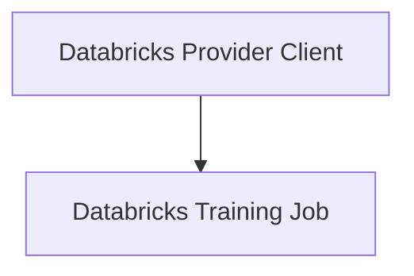

# Databricks Integration Module

## Introduction

The `databricks_integration` module provides a comprehensive interface for integrating with Databricks, enabling the finetuning and deployment of language models within the Databricks environment. It abstracts away the complexities of Databricks API interactions, offering streamlined functionalities for model lifecycle management.

## Architecture Overview

The module's architecture is centered around two core components: the `DatabricksProvider` and `TrainingJobDatabricks`. The `DatabricksProvider` acts as the primary client, managing operations such as data uploads to Unity Catalog, initiating finetuning runs, and deploying finetuned models as serving endpoints. The `TrainingJobDatabricks` component serves as a dedicated tracker for the status and metadata of ongoing finetuning jobs.

<!-- DIAGRAM_JSON
{
    "direction": "TD",
    "nodes": [
        {"id": "databricks_provider_client", "label": "Databricks Provider Client", "type": "module", "link": "databricks_provider_client.md"},
        {"id": "databricks_training_job", "label": "Databricks Training Job", "type": "module", "link": "databricks_training_job.md"}
    ],
    "edges": [
        {"source": "databricks_provider_client", "target": "databricks_training_job"}
    ],
    "groups": []
}
-->

## Sub-modules

This module is composed of the following sub-modules, each handling specific aspects of the Databricks integration:

*   ### [Databricks Provider Client](databricks_provider_client.md)
    Handles core interactions with Databricks for model deployment, finetuning, and data uploading.

*   ### [Databricks Training Job](databricks_training_job.md)
    Manages the lifecycle and status tracking of finetuning jobs on Databricks.
