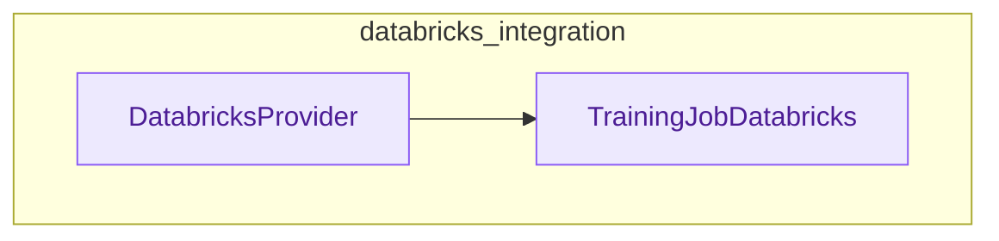

# databricks_integration
The `databricks_integration` module facilitates interaction with Databricks for AI model operations. It includes a provider for deploying finetuned models and a dedicated class for managing Databricks training jobs.

<!-- DIAGRAM_JSON
{
  "nodes": [
    {
      "id": "DatabricksProvider",
      "label": "DatabricksProvider",
      "type": "class"
    },
    {
      "id": "TrainingJobDatabricks",
      "label": "TrainingJobDatabricks",
      "type": "class"
    }
  ],
  "edges": [
    {
      "source": "DatabricksProvider",
      "target": "TrainingJobDatabricks",
      "label": "uses"
    }
  ],
  "groups": [
    {
      "id": "databricks_integration",
      "label": "databricks_integration",
      "nodes": ["DatabricksProvider", "TrainingJobDatabricks"]
    }
  ]
}
-->
