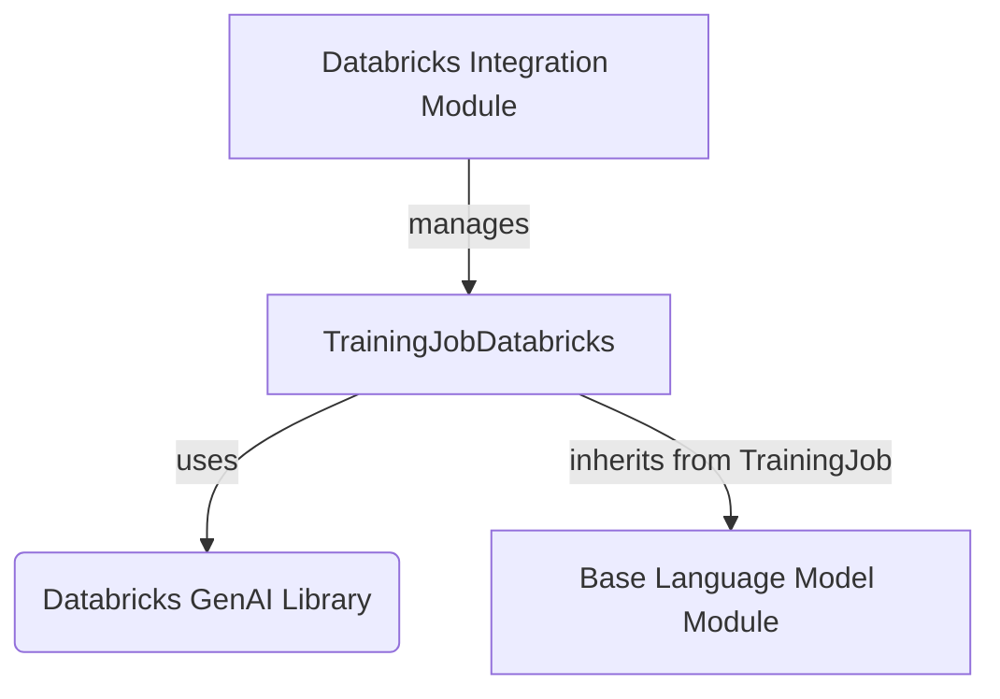

# databricks_training_job

## Introduction
The `databricks_training_job` module provides functionality for managing finetuning training jobs on Databricks. It offers a standardized interface for initiating and monitoring the status of these jobs within the DSPy framework.

## Purpose and Core Functionality
This module's primary purpose is to abstract the complexities of interacting with the Databricks foundation model training API. The core component, `TrainingJobDatabricks`, allows users to:
- Initialize a finetuning job with a reference to a Databricks finetuning run ID.
- Query the current status of an ongoing or completed finetuning job on Databricks.

The module ensures that the necessary `databricks_genai` package is installed, guiding the user if it's missing.

## Architecture and Component Relationships

<!-- DIAGRAM_JSON
{
    "direction": "TD",
    "nodes": [
        {"id": "training_job_databricks", "label": "TrainingJobDatabricks", "type": "component", "link": null},
        {"id": "databricks_genai_lib", "label": "Databricks GenAI Library", "type": "external", "link": null},
        {"id": "databricks_integration_mod", "label": "Databricks Integration Module", "type": "external", "link": "databricks_integration.md"},
        {"id": "base_lm_mod", "label": "Base Language Model Module", "type": "external", "link": "base_language_model.md"}
    ],
    "edges": [
        {"source": "training_job_databricks", "target": "databricks_genai_lib", "label": "uses"},
        {"source": "training_job_databricks", "target": "base_lm_mod", "label": "inherits from TrainingJob"},
        {"source": "databricks_integration_mod", "target": "training_job_databricks", "label": "manages"}
    ],
    "groups": []
}
-->

### Component Breakdown:

*   **`TrainingJobDatabricks`**:
    *   **Purpose**: This class is the central component of the module. It extends a base `TrainingJob` class (likely from the `base_language_model` module) to provide Databricks-specific finetuning job management.
    *   **Key Methods**:
        *   `__init__(self, finetuning_run=None, *args, **kwargs)`: Initializes the training job instance, optionally linking it to an existing Databricks finetuning run ID.
        *   `status(self)`: Retrieves and returns the current status of the associated Databricks finetuning run using the `databricks.model_training.foundation_model` API.
    *   **Dependencies**: Relies on the external `databricks_genai` library for direct interaction with Databricks APIs. It also implicitly depends on the base `TrainingJob` class for its foundational structure.

## How the Module Fits into the Overall System
The `databricks_training_job` module is a specialized client within the broader `dspy_clients.databricks_integration` ecosystem. It works in conjunction with the `databricks_provider_client` module, which likely handles general Databricks API interactions, while `databricks_training_job` focuses specifically on the lifecycle of finetuning jobs.

By inheriting from a base `TrainingJob` class (defined or exposed by the `base_language_model` module), `TrainingJobDatabricks` maintains a consistent interface with other training job implementations, such as those for OpenAI (found in `openai_finetuning`). This allows DSPy to offer a unified approach to managing finetuning across different platforms.

This module is crucial for users who leverage Databricks for custom model training, enabling DSPy programs to seamlessly integrate and monitor their finetuning efforts.