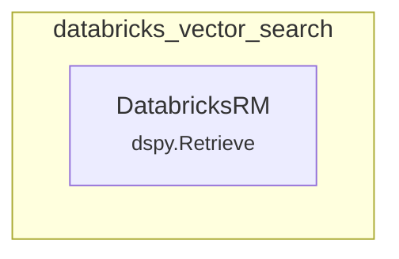

# databricks_vector_search
This module provides the DatabricksRM retriever, enabling DSPy applications to query Databricks Mosaic AI Vector Search Indexes for relevant information.

<!-- DIAGRAM_JSON
{
    "nodes": [
        {
            "id": "databricks_vector_search",
            "label": "databricks_vector_search",
            "type": "module"
        },
        {
            "id": "DatabricksRM",
            "label": "DatabricksRM",
            "type": "class",
            "parent": "dspy.Retrieve"
        }
    ],
    "edges": [
        {
            "source": "databricks_vector_search",
            "target": "DatabricksRM",
            "type": "contains"
        }
    ],
    "groups": [
        {
            "id": "databricks_vector_search_group",
            "label": "databricks_vector_search",
            "nodes": [
                "DatabricksRM"
            ]
        }
    ]
}
-->
