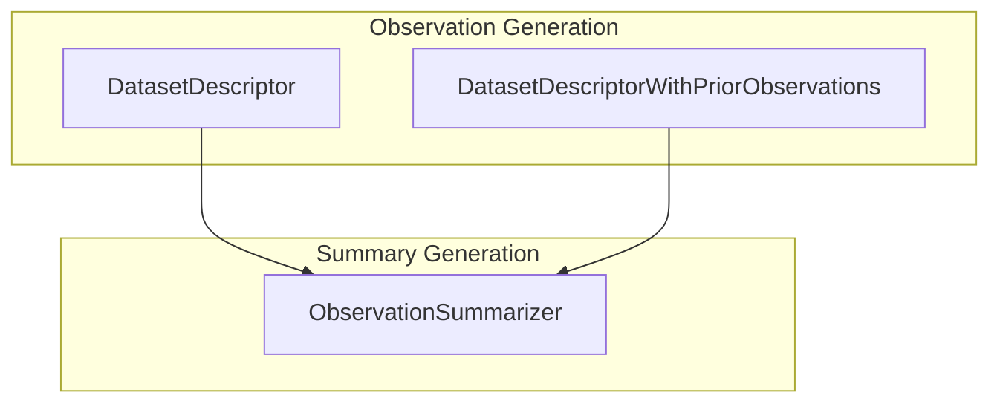

# dataset_analysis
This module provides tools for analyzing datasets by generating detailed observations from examples and then summarizing those observations into concise highlights. It supports both initial observation generation and refinement with prior insights.

<!-- DIAGRAM_JSON
{
    "nodes": [
        {
            "id": "DatasetDescriptor",
            "label": "DatasetDescriptor"
        },
        {
            "id": "DatasetDescriptorWithPriorObservations",
            "label": "DatasetDescriptorWithPriorObservations"
        },
        {
            "id": "ObservationSummarizer",
            "label": "ObservationSummarizer"
        }
    ],
    "edges": [
        {
            "source": "DatasetDescriptor",
            "target": "ObservationSummarizer",
            "label": "observations"
        },
        {
            "source": "DatasetDescriptorWithPriorObservations",
            "target": "ObservationSummarizer",
            "label": "observations"
        }
    ],
    "groups": [
        {
            "id": "ObservationGeneration",
            "label": "Observation Generation",
            "nodes": [
                "DatasetDescriptor",
                "DatasetDescriptorWithPriorObservations"
            ]
        },
        {
            "id": "SummaryGeneration",
            "label": "Summary Generation",
            "nodes": [
                "ObservationSummarizer"
            ]
        }
    ]
}
-->
