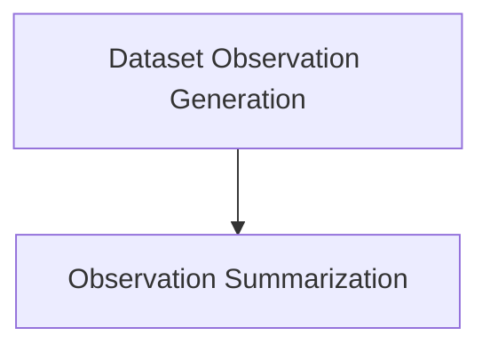

# Dataset Analysis Module

## Introduction
The `dataset_analysis` module, part of `dspy.propose`, provides tools for understanding and summarizing datasets. Its primary purpose is to help users gain insights into their data by generating observations and concise summaries, which can be crucial for tasks like program proposal and prompt engineering.

## Architecture Overview
The `dataset_analysis` module is structured into two main sub-modules:
- `dataset_observation_generation`: Focuses on extracting initial observations from dataset examples.
- `observation_summarization`: Responsible for condensing detailed observations into brief summaries.

These sub-modules interact to provide a comprehensive dataset analysis workflow, starting from raw examples to high-level insights.

### Module Relationships
<!-- DIAGRAM_JSON
{
    "direction": "TD",
    "nodes": [
        {"id": "dataset_observation_generation", "label": "Dataset Observation Generation", "type": "module", "link": "dataset_observation_generation.md"},
        {"id": "observation_summarization", "label": "Observation Summarization", "type": "module", "link": "observation_summarization.md"}
    ],
    "edges": [
        {"source": "dataset_observation_generation", "target": "observation_summarization"}
    ],
    "groups": []
}
-->

## Sub-modules

### [Dataset Observation Generation](dataset_observation_generation.md)
This sub-module contains functionalities for generating initial observations from a given set of dataset examples. It includes mechanisms to either create new observations from scratch or to augment existing observations with new insights.

### [Observation Summarization](observation_summarization.md)
This sub-module is designed to take a collection of detailed observations about a dataset and distill them into a concise, high-level summary. It helps in quickly grasping the most significant aspects of the dataset without delving into all the granular observations.