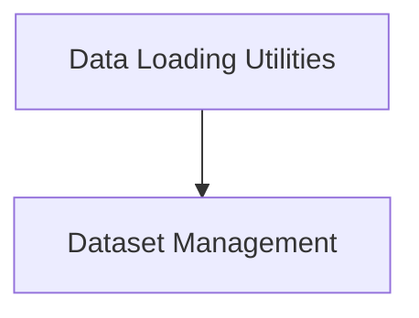

# Dataset Base Components

This module provides the foundational classes for managing and loading datasets within the dspy library. It includes utilities for defining dataset properties, handling data splits, and loading data from various formats and sources.

## Architecture Overview

The `dataset_base_components` module is composed of two primary sub-modules:

1.  **Dataset Management**: Handles the core logic for dataset initialization, seed management, and splitting.
2.  **Data Loading Utilities**: Provides a flexible interface for loading datasets from external sources.

<!-- DIAGRAM_JSON
{
    "direction": "TD",
    "nodes": [
        {"id": "dataset_management", "label": "Dataset Management", "type": "module", "link": "dataset_management.md"},
        {"id": "data_loading_utilities", "label": "Data Loading Utilities", "type": "module", "link": "data_loading_utilities.md"}
    ],
    "edges": [
        {"source": "data_loading_utilities", "target": "dataset_management"}
    ],
    "groups": []
}
-->

## Sub-module Functionality

### [Dataset Management](dataset_management.md)
This sub-module, centered around the `dspy.datasets.dataset.Dataset` class, provides the base structure for defining and manipulating datasets. It offers functionalities for setting training, development, and testing splits, managing random seeds for reproducibility, and shuffling/sampling data.

### [Data Loading Utilities](data_loading_utilities.md)
This sub-module, primarily implemented by the `dspy.datasets.dataloader.DataLoader` class, extends the base Dataset functionality to include robust data loading capabilities. It supports importing data from a wide range of sources, including Hugging Face datasets, CSV files, Pandas DataFrames, JSON files, Parquet files, and custom Retrieval Modules. It also provides utilities for sampling and performing train-test splits on loaded datasets.