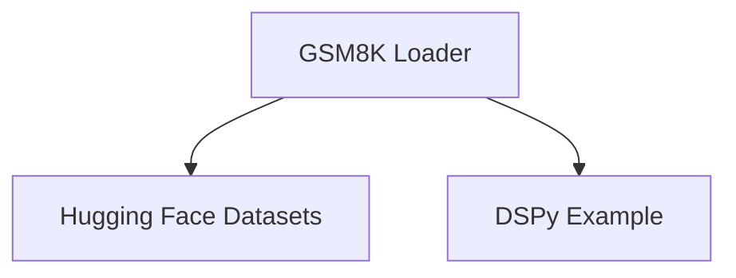

# Dataset Loading Module

The `dataset_loading` module is a specialized component within the `gsm8k_dataset` module, primarily responsible for loading and preparing the GSM8K (Grade School Math 8K) dataset. This module provides the `GSM8K` class, which encapsulates the logic for fetching the dataset from Hugging Face, parsing its contents, and structuring it into a format suitable for use with DSPy.

## Module Architecture

<!-- DIAGRAM_JSON
{
    "direction": "TD",
    "nodes": [
        {"id": "gsm8k_loader", "label": "GSM8K Loader", "type": "component", "link": null},
        {"id": "huggingface_datasets", "label": "Hugging Face Datasets", "type": "external", "link": "https://huggingface.co/datasets/gsm8k"},
        {"id": "dspy_example", "label": "DSPy Example", "type": "external", "link": "dataset_base_components.md"}
    ],
    "edges": [
        {"source": "gsm8k_loader", "target": "huggingface_datasets"},
        {"source": "gsm8k_loader", "target": "dspy_example"}
    ],
    "groups": []
}
-->

## Core Functionality

The `GSM8K` class is the central component of this module, handling the entire dataset loading and preprocessing pipeline for the GSM8K dataset.

### `GSM8K` Class

`dspy.datasets.gsm8k.GSM8K`

This class initializes and prepares the GSM8K dataset. It performs the following key operations:

*   **Dataset Fetching**: Utilizes the `datasets` library from Hugging Face to load the "gsm8k" dataset with the "main" configuration.
*   **Data Parsing**: Iterates through the raw training and testing examples. For each example, it extracts the `question`, `gold_reasoning`, and `answer`. The `answer` is specifically parsed to remove the "####" separator and convert the numerical answer to an integer string.
*   **Data Shuffling**: Randomly shuffles both the training and testing datasets using a fixed seed (0) for reproducibility.
*   **Dataset Splitting**: Divides the official training set into a smaller `trainset` (200 examples) and a `devset` (300 examples). The official test set is used entirely as the `testset`.
*   **DSPy Example Conversion**: Converts the processed examples into `dspy.Example` objects, explicitly setting "question" as the input field. This prepares the data for use within DSPy programs.

#### Attributes:

*   `train` (list of `dspy.Example`): The training subset of the GSM8K dataset.
*   `dev` (list of `dspy.Example`): The development subset of the GSM8K dataset.
*   `test` (list of `dspy.Example`): The testing subset of the GSM8K dataset.

## Relationships to Other Modules

*   **[gsm8k_dataset.md](gsm8k_dataset.md)**: This module is a direct sub-component of `gsm8k_dataset`, providing the actual dataset loading mechanism.
*   **[dataset_base_components.md](dataset_base_components.md)**: The `GSM8K` class leverages `dspy.Example` (defined in `dspy.datasets.dataset.Dataset`), which is a fundamental data structure within DSPy datasets. This highlights the dependency on the base dataset components for structuring the loaded data.