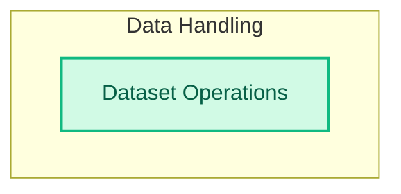

# Dataset Management

This module provides essential tools for managing and preparing datasets for DSPy programs, including functionalities for loading data from diverse sources and splitting it for training and evaluation.

<!-- DIAGRAM_JSON
{
    "direction": "TD",
    "nodes": [
        {
            "id": "dataset_management",
            "label": "Dataset Management",
            "type": "module"
        },
        {
            "id": "dataset_operations",
            "label": "Dataset Operations",
            "type": "module",
            "link": "dataset_operations.md"
        }
    ],
    "edges": [],
    "groups": [
        {
            "id": "data_handling",
            "label": "Data Handling",
            "role": "data",
            "nodes": [
                "dataset_operations"
            ]
        }
    ]
}
-->
