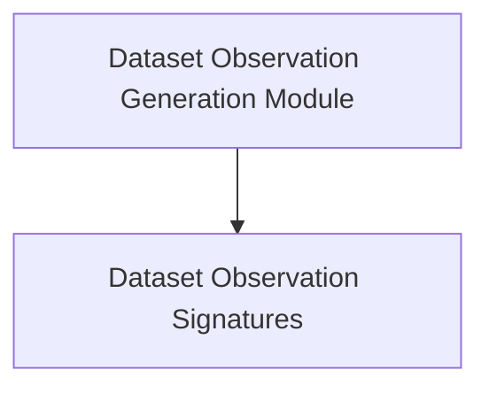

# Dataset Observation Generation Module

The `dataset_observation_generation` module is a crucial part of the `dspy.propose` package, focusing on the automated generation of insightful observations and descriptions from datasets. It provides core functionalities for analyzing sample data points and identifying trends, syntax, topics, and other relevant characteristics, aiding in understanding the potential task a dataset is designed for.

## Architecture

The module's architecture is straightforward, primarily consisting of signature definitions that guide the process of generating dataset observations. It builds upon the foundational `dspy.Signature` class to create structured prompts for language models to perform these observational tasks.

<!-- DIAGRAM_JSON
{
    "direction": "TD",
    "nodes": [
        {"id": "dataset_observation_signatures", "label": "Dataset Observation Signatures", "type": "module", "link": "dataset_observation_signatures.md"}
    ],
    "edges": [],
    "groups": []
}
-->

## Sub-modules

### [Dataset Observation Signatures](dataset_observation_signatures.md)
This sub-module defines the programmatic signatures, `DatasetDescriptor` and `DatasetDescriptorWithPriorObservations`, which are used to generate observations about dataset examples. These signatures facilitate the description of dataset characteristics and the inference of the underlying task, optionally incorporating prior observations for iterative refinement.