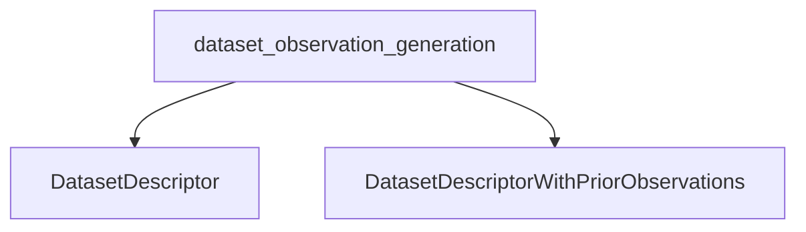

# Module: `dataset_observation_signatures`

## Introduction
The `dataset_observation_signatures` module provides DSPy signatures specifically designed for generating descriptive observations about datasets. These signatures are fundamental for automated data analysis within the DSPy framework, enabling the system to understand the underlying characteristics, trends, and potential tasks associated with a given dataset. This understanding is crucial for subsequent steps like program generation and optimization.

## Core Functionality

The module defines two key DSPy signatures:

### `DatasetDescriptor`
This signature is used to generate initial, comprehensive observations about a dataset based solely on provided examples. It encourages the language model to act as an analyst, identifying patterns, topics, content styles, and even making educated guesses about the dataset's intended use case.

**Purpose:** To provide a holistic understanding of a dataset from raw samples.

**Fields:**
*   `examples`: Input field containing sample data points from the dataset.
*   `observations`: Output field for the generated descriptive observations about the dataset's trends, characteristics, and potential task.

### `DatasetDescriptorWithPriorObservations`
Building upon the `DatasetDescriptor`, this signature allows for iterative observation generation. It takes existing observations as input and prompts the language model to either augment these observations with new insights or confirm their completeness.

**Purpose:** To refine and extend dataset observations incrementally, allowing for collaborative or multi-step analysis.

**Fields:**
*   `examples`: Input field containing sample data points from the dataset.
*   `prior_observations`: Input field containing pre-existing observations about the data.
*   `observations`: Output field for new observations or the string "COMPLETE" if no further observations are deemed necessary.

## Architecture and Component Relationships

The `dataset_observation_signatures` module is a leaf module within the `dspy_program_proposal` hierarchy, specifically under `dspy_propose.dataset_analysis.dataset_observation_generation`. It provides the foundational signatures used by higher-level components for describing and analyzing datasets.

<!-- DIAGRAM_JSON
{
    "direction": "TD",
    "nodes": [
        {"id": "DatasetDescriptor", "label": "DatasetDescriptor", "type": "component", "link": null},
        {"id": "DatasetDescriptorWithPriorObservations", "label": "DatasetDescriptorWithPriorObservations", "type": "component", "link": null},
        {"id": "dataset_observation_generation", "label": "dataset_observation_generation", "type": "external", "link": "dataset_observation_generation.md"}
    ],
    "edges": [
        {"source": "dataset_observation_generation", "target": "DatasetDescriptor"},
        {"source": "dataset_observation_generation", "target": "DatasetDescriptorWithPriorObservations"}
    ],
    "groups": []
}
-->

## How the Module Fits into the Overall System

This module plays a critical role in the automated program proposal and optimization pipeline within DSPy. By providing structured ways to generate and refine dataset observations, it enables other modules, particularly those in [dspy_program_proposal](dspy_program_proposal.md) and [dspy_teleprompting_optimizers](dspy_teleprompting_optimizers.md), to:

*   **Understand Data Context:** Gain an initial understanding of a dataset's nature, which can inform the choice of program structures or prompting strategies.
*   **Guide Program Generation:** The observations generated here can be used to constrain or guide the automatic generation of DSPy programs that are well-suited to the dataset's characteristics.
*   **Facilitate Optimization:** For teleprompting and optimization techniques, a clear description of the dataset allows for more targeted feedback and more effective iterative improvements.

In essence, `dataset_observation_signatures` acts as an initial analytical layer, translating raw data examples into actionable insights that drive more intelligent and context-aware DSPy program development.