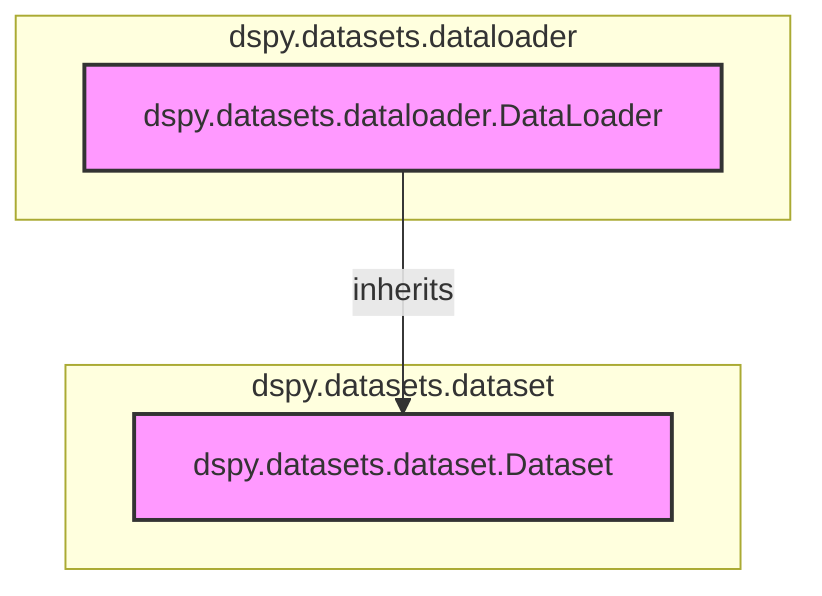

# dataset_operations
This module provides foundational classes for managing and loading datasets within the dspy framework, including a base `Dataset` class and a `DataLoader` for various data sources.

<!-- DIAGRAM_JSON
{
    "nodes": [
        {
            "id": "DataLoader",
            "label": "dspy.datasets.dataloader.DataLoader",
            "type": "class"
        },
        {
            "id": "Dataset",
            "label": "dspy.datasets.dataset.Dataset",
            "type": "class"
        }
    ],
    "edges": [
        {
            "source": "DataLoader",
            "target": "Dataset",
            "type": "inherits"
        }
    ],
    "groups": [
        {
            "id": "dspy.datasets.dataloader",
            "label": "dspy.datasets.dataloader",
            "nodes": [
                "DataLoader"
            ]
        },
        {
            "id": "dspy.datasets.dataset",
            "label": "dspy.datasets.dataset",
            "nodes": [
                "Dataset"
            ]
        }
    ]
}
-->
