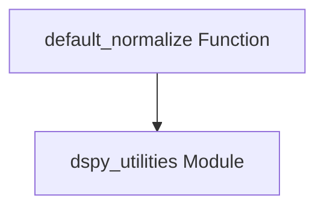

# default_normalization Module Documentation

## Introduction
The `default_normalization` module, located within `dspy.predict.aggregation`, provides a simple yet crucial utility for text normalization. Its primary purpose is to ensure consistency in text processing, particularly when aggregating predictions. By applying a default normalization function, it helps standardize textual inputs or outputs, which is essential for accurate comparisons and aggregations in various prediction strategies.

## Architecture and Component Relationships

<!-- DIAGRAM_JSON
{
    "direction": "TD",
    "nodes": [
        {"id": "default_normalize_func", "label": "default_normalize Function", "type": "component", "link": null},
        {"id": "dspy_utilities_module", "label": "dspy_utilities Module", "type": "external", "link": "dspy_utilities.md"}
    ],
    "edges": [
        {"source": "default_normalize_func", "target": "dspy_utilities_module"}
    ],
    "groups": []
}
-->

The diagram illustrates the straightforward architecture of the `default_normalization` module. The core `default_normalize` function relies on a utility function, likely `normalize_text`, which is assumed to be provided by the `dspy_utilities` module. This dependency highlights the module's role as a wrapper or adapter that leverages existing general-purpose utilities for specific application within prediction aggregation.

## Core Functionality

### `default_normalize` Function

The `default_normalize` function is the sole exposed component of this module. It serves as a convenience wrapper around a more general text normalization utility.

**`dspy.predict.aggregation.default_normalize(s)`**

-   **Purpose**: To normalize a given string `s` using a predefined text normalization logic.
-   **Parameters**:
    -   `s`: The input string to be normalized.
-   **Returns**: The normalized string, or `None` if the normalization process results in an empty or null value.
-   **Dependencies**: This function internally calls `normalize_text(s)`. The `normalize_text` utility is expected to handle the actual normalization logic, such as converting text to lowercase, removing punctuation, or handling whitespace, and is assumed to reside in the [dspy_utilities](dspy_utilities.md) module.

## Integration with the Overall System
The `default_normalization` module plays a supportive role within the broader `dspy_prediction_strategies` ecosystem, specifically under `prediction_aggregation`. It ensures that textual outputs or inputs are consistently processed before being aggregated, preventing discrepancies that could arise from variations in text formatting. This standardization is critical for the accurate functioning of aggregation strategies like `majority_aggregation` or other custom aggregation methods that rely on comparing or combining textual data. By centralizing the default normalization logic, it promotes maintainability and consistency across different prediction aggregation components.
