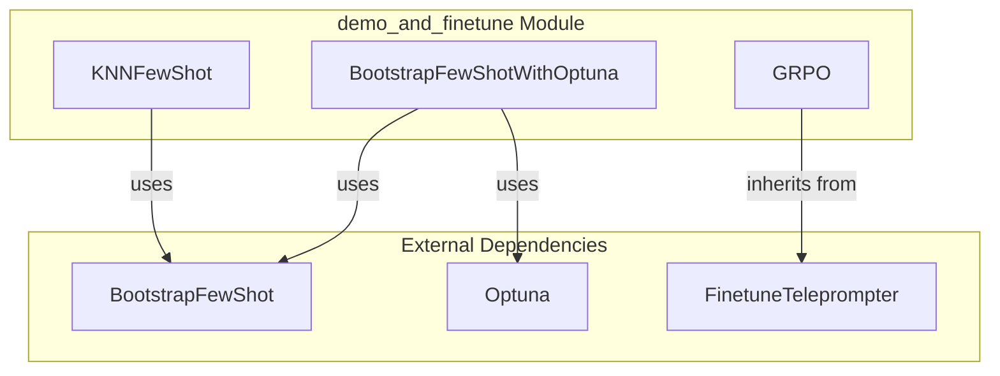

# demo_and_finetune
This module provides advanced teleprompters for Dspy programs, including KNN-based few-shot optimization, Optuna-driven demonstration selection, and gradient-based policy finetuning.

<!-- DIAGRAM_JSON
{
  "nodes": [
    {"id": "A", "label": "KNNFewShot"},
    {"id": "B", "label": "BootstrapFewShotWithOptuna"},
    {"id": "C", "label": "GRPO"},
    {"id": "D", "label": "BootstrapFewShot"},
    {"id": "E", "label": "Optuna"},
    {"id": "F", "label": "FinetuneTeleprompter"}
  ],
  "edges": [
    {"source": "A", "target": "D", "label": "uses"},
    {"source": "B", "target": "D", "label": "uses"},
    {"source": "B", "target": "E", "label": "uses"},
    {"source": "C", "target": "F", "label": "inherits from"}
  ],
  "groups": [
    {"id": "demo_and_finetune", "label": "demo_and_finetune Module", "nodes": ["A", "B", "C"]},
    {"id": "External", "label": "External Dependencies", "nodes": ["D", "E", "F"]}
  ]
}
-->
