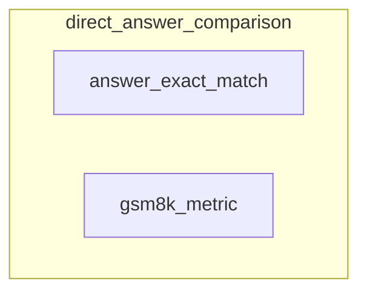

# direct_answer_comparison
This module provides metrics for comparing direct answers, including exact match and F1-score based comparisons, as well as a specific metric for integer answers in the GSM8K dataset.

<!-- DIAGRAM_JSON
{
  "nodes": [
    {"id": "answer_exact_match", "label": "answer_exact_match", "type": "function"},
    {"id": "gsm8k_metric", "label": "gsm8k_metric", "type": "function"}
  ],
  "edges": [],
  "groups": [
    {"id": "direct_answer_comparison", "label": "direct_answer_comparison", "nodes": ["answer_exact_match", "gsm8k_metric"]}
  ]
}
-->
