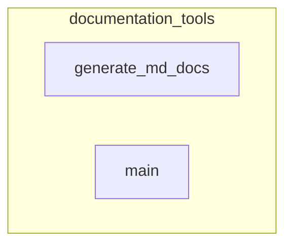

# documentation_tools
This module provides utilities for automating API documentation generation, including creating markdown files from source code and updating the mkdocs.yml configuration.

<!-- DIAGRAM_JSON
{
    "nodes": [
        {
            "id": "generate_md_docs",
            "label": "generate_md_docs"
        },
        {
            "id": "main",
            "label": "main"
        }
    ],
    "edges": [],
    "groups": [
        {
            "id": "documentation_tools",
            "label": "documentation_tools",
            "nodes": [
                "generate_md_docs",
                "main"
            ]
        }
    ]
}
-->
