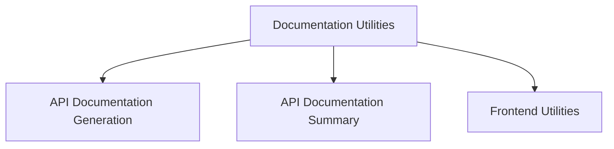

# Documentation Utilities Module

## Introduction and Purpose

The `documentation_utilities` module provides a suite of tools designed to automate and streamline the process of generating, managing, and enhancing system documentation, particularly for the `dspy` package's API. Its primary goal is to ensure that the project's documentation is comprehensive, up-to-date, and easily navigable for developers and maintainers.

## Architecture Overview

This module is structured around core functionalities that handle different aspects of documentation. It includes scripts for automatically generating Markdown documentation from code, tools for creating and integrating API documentation summaries into the project's navigation, and client-side utilities to improve the user experience when interacting with the documentation.

<!-- DIAGRAM_JSON
{
    "direction": "TD",
    "nodes": [
        {"id": "documentation_utilities", "label": "Documentation Utilities", "type": "module"},
        {"id": "api_documentation_generation", "label": "API Documentation Generation", "type": "module", "link": "api_documentation_generation.md"},
        {"id": "api_documentation_summary", "label": "API Documentation Summary", "type": "module", "link": "api_documentation_summary.md"},
        {"id": "frontend_utilities", "label": "Frontend Utilities", "type": "module", "link": "frontend_utilities.md"}
    ],
    "edges": [
        {"source": "documentation_utilities", "target": "api_documentation_generation"},
        {"source": "documentation_utilities", "target": "api_documentation_summary"},
        {"source": "documentation_utilities", "target": "frontend_utilities"}
    ],
    "groups": []
}
-->

## Sub-modules and their Functionality

This module is composed of the following key sub-modules:

*   **[API Documentation Generation](api_documentation_generation.md)**: This sub-module is responsible for the automated generation of Markdown documentation files for the dspy package's public API. It processes source code to extract public classes and functions and formats them into readable documentation pages.

*   **[API Documentation Summary](api_documentation_summary.md)**: This sub-module focuses on generating a summary of the API documentation and integrating it into the `mkdocs.yml` navigation structure. It ensures that the generated API documentation is properly linked and discoverable within the overall project documentation.

*   **[Frontend Utilities](frontend_utilities.md)**: This sub-module provides client-side functionalities that enhance the documentation user experience, such as a feature to copy page content as Markdown, making it easier for users to reuse or share documentation snippets.