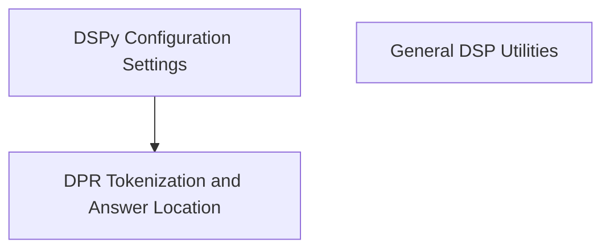

# DSP Utilities (`dsp_utils`)

The `dsp_utils` module provides a collection of utility functions and classes that support various functionalities within the DSPy framework, particularly focusing on components related to Dense Passage Retrieval (DPR) tokenization, global settings management, and data loading.

## Architecture Overview

The `dsp_utils` module is structured into several sub-modules, each handling a specific aspect of the utility functionalities. This modular design enhances maintainability and allows for clear separation of concerns.

<!-- DIAGRAM_JSON
{
    "direction": "TD",
    "nodes": [
        {"id": "dpr_utilities", "label": "DPR Tokenization and Answer Location", "type": "module", "link": "dpr_utilities.md"},
        {"id": "settings_management", "label": "DSPy Configuration Settings", "type": "module", "link": "settings_management.md"},
        {"id": "general_utilities", "label": "General DSP Utilities", "type": "module", "link": "general_utilities.md"}
    ],
    "edges": [
        {"source": "settings_management", "target": "dpr_utilities"}
    ],
    "groups": []
}
-->

## Sub-modules

### [DPR Tokenization and Answer Location](dpr_utilities.md)
This sub-module provides utilities for tokenizing text and locating answers within tokenized text, specifically designed for Dense Passage Retrieval (DPR) contexts.

### [DSPy Configuration Settings](settings_management.md)
This sub-module manages global and thread-local configuration settings for DSPy, including language model, adapter, and other runtime parameters.

### [General DSP Utilities](general_utilities.md)
This sub-module contains miscellaneous utility functions for DSPy, such as loading batch backgrounds for retrieval.

