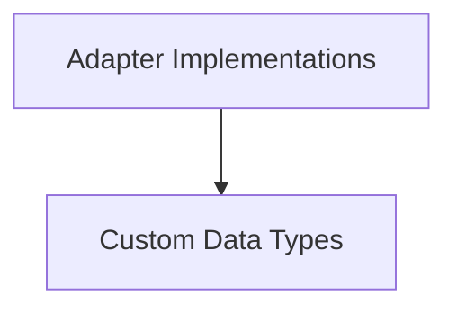

# DSPy Adapters Module

The `dspy_adapters` module in DSPy serves as the crucial interface layer between DSPy modules/signatures and various Language Models (LMs). It is responsible for transforming DSPy-specific inputs into LM-compatible prompts, parsing LM outputs back into structured DSPy formats, and managing native LM features like function calling and custom type processing. This abstraction allows DSPy to maintain a consistent programming model regardless of the underlying LM.

## Architecture Overview

The `dspy_adapters` module is structured into two main sub-modules: `adapter_implementations` and `custom_types`. The `adapter_implementations` handle the core logic of adapting DSPy signatures to LM calls, while `custom_types` provide extensible data structures for rich input and output handling.

<!-- DIAGRAM_JSON
{
    "direction": "TD",
    "nodes": [
        {"id": "adapter_implementations", "label": "Adapter Implementations", "type": "module", "link": "adapter_implementations.md"},
        {"id": "custom_types", "label": "Custom Data Types", "type": "module", "link": "custom_types.md"}
    ],
    "edges": [
        {"source": "adapter_implementations", "target": "custom_types"}
    ],
    "groups": []
}
-->

## Sub-modules

### Adapter Implementations

The `adapter_implementations` sub-module houses the core logic for translating DSPy signatures into LM-specific requests and parsing their responses. It includes the base `Adapter` class, providing a foundational structure for all adapters, as well as specialized implementations like `BAMLAdapter` for enhanced Pydantic model rendering and `TwoStepAdapter` for multi-stage LM interactions.

For more detailed information, refer to the [Adapter Implementations Documentation](adapter_implementations.md).

### Custom Data Types

The `custom_types` sub-module defines a rich set of data types that extend DSPy's capabilities to handle diverse input and output formats. This includes types for handling `Audio`, `Code`, `Document`, `File`, `Image`, `Citation`, and `Tool` objects, enabling seamless integration of complex data structures within DSPy programs.

For more detailed information, refer to the [Custom Data Types Documentation](custom_types.md).
