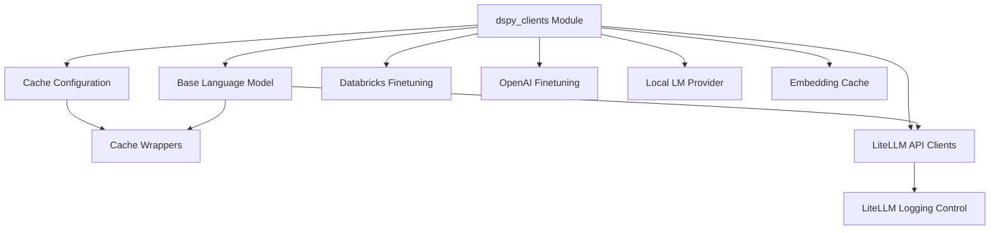

# dspy_clients Module Documentation

## Introduction

The `dspy_clients` module serves as the foundational layer for interacting with various language models (LMs) and managing related functionalities within the DSPy framework. It provides abstractions for different LM providers, caching mechanisms, and finetuning integrations, enabling seamless communication with both local and cloud-based models.

## Architecture Overview

The `dspy_clients` module is structured to provide a flexible and extensible interface for interacting with diverse language model services. It defines a `BaseLM` class that all specific LM implementations can inherit from, ensuring a consistent API. The module integrates robust caching for performance optimization and includes specialized components for finetuning with platforms like Databricks and OpenAI, as well as support for local LM deployment.

<!-- DIAGRAM_JSON
{
    "direction": "TD",
    "nodes": [
        {"id": "dspy_clients", "label": "dspy_clients Module", "type": "module"},
        {"id": "base_language_model", "label": "Base Language Model", "type": "module", "link": "base_language_model.md"},
        {"id": "cache_management", "label": "Cache Configuration", "type": "module", "link": "cache_management.md"},
        {"id": "cache_operations", "label": "Cache Wrappers", "type": "module", "link": "cache_operations.md"},
        {"id": "litellm_api_clients", "label": "LiteLLM API Clients", "type": "module", "link": "litellm_api_clients.md"},
        {"id": "litellm_logging", "label": "LiteLLM Logging Control", "type": "module", "link": "litellm_logging.md"},
        {"id": "databricks_integration", "label": "Databricks Finetuning", "type": "module", "link": "databricks_integration.md"},
        {"id": "openai_finetuning", "label": "OpenAI Finetuning", "type": "module", "link": "openai_finetuning.md"},
        {"id": "local_lm_provider", "label": "Local LM Provider", "type": "module", "link": "local_lm_provider.md"},
        {"id": "embedding_cache", "label": "Embedding Cache", "type": "module", "link": "embedding_cache.md"}
    ],
    "edges": [
        {"source": "dspy_clients", "target": "base_language_model"},
        {"source": "dspy_clients", "target": "cache_management"},
        {"source": "dspy_clients", "target": "litellm_api_clients"},
        {"source": "dspy_clients", "target": "databricks_integration"},
        {"source": "dspy_clients", "target": "openai_finetuning"},
        {"source": "dspy_clients", "target": "local_lm_provider"},
        {"source": "dspy_clients", "target": "embedding_cache"},
        {"source": "cache_management", "target": "cache_operations"},
        {"source": "litellm_api_clients", "target": "litellm_logging"},
        {"source": "base_language_model", "target": "cache_operations"},
        {"source": "base_language_model", "target": "litellm_api_clients"}
    ],
    "groups": []
}
-->

## Sub-modules

*   **[Base Language Model](base_language_model.md)**: Defines the abstract base class for all language models in DSPy, outlining common properties and methods for LLM interaction.
*   **[Cache Configuration](cache_management.md)**: Handles the initialization and configuration of DSPy's caching mechanism, allowing control over disk and memory cache settings.
*   **[Cache Wrappers](cache_operations.md)**: Implements synchronous and asynchronous wrappers for caching LLM responses, optimizing performance by storing and retrieving results.
*   **[Databricks Finetuning](databricks_integration.md)**: Facilitates finetuning and deployment of models on Databricks, including data upload and job management.
*   **[Embedding Cache](embedding_cache.md)**: Provides cached functions for computing embeddings, improving efficiency by avoiding redundant computations.
*   **[LiteLLM API Clients](litellm_api_clients.md)**: Offers a suite of synchronous and asynchronous clients for interacting with LiteLLM, supporting various completion and streaming functionalities.
*   **[LiteLLM Logging Control](litellm_logging.md)**: Provides functions to enable or disable detailed logging for LiteLLM interactions, aiding in debugging and monitoring.
*   **[Local LM Provider](local_lm_provider.md)**: Enables the use of locally hosted language models within DSPy, including server management and local finetuning capabilities.
*   **[OpenAI Finetuning](openai_finetuning.md)**: Manages training jobs and associated files for finetuning models on the OpenAI platform, including cancellation and status checks.
