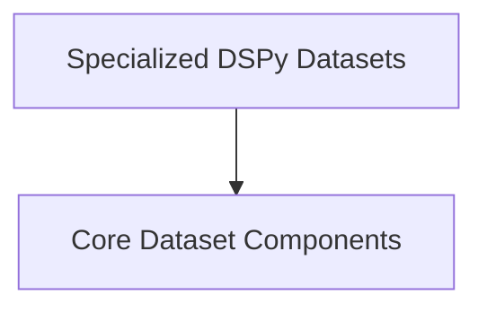

# dspy_datasets Module Documentation

## Introduction

The `dspy_datasets` module provides a comprehensive suite of tools for handling various datasets within the DSPy framework. It includes functionalities for loading datasets from different sources, managing dataset splits (train, dev, test), and implementing specific benchmark datasets like AlfWorld, GSM8K, and MATH. This module is crucial for setting up and evaluating DSPy programs.

## Architecture Overview

The `dspy_datasets` module is structured into core components for general dataset management and specialized implementations for popular benchmarks. The architecture is designed to be flexible, allowing easy integration of new datasets and custom data loading strategies.

<!-- DIAGRAM_JSON
{
    "direction": "TD",
    "nodes": [
        {"id": "dataset_base_components", "label": "Core Dataset Components", "type": "module", "link": "dataset_base_components.md"},
        {"id": "specialized_datasets", "label": "Specialized DSPy Datasets", "type": "module", "link": "specialized_datasets.md"}
    ],
    "edges": [
        {"source": "specialized_datasets", "target": "dataset_base_components"}
    ],
    "groups": []
}
-->

## Sub-modules

### Core Dataset Components

The `dataset_base_components` sub-module ([dataset_base_components.md](dataset_base_components.md)) provides the foundational classes for dataset handling in DSPy. It includes the `Dataset` class for managing dataset splits and the `DataLoader` class for loading data from various formats like Hugging Face datasets, CSV, Pandas DataFrames, JSON, and Parquet.

### Specialized DSPy Datasets

The `specialized_datasets` sub-module ([specialized_datasets.md](specialized_datasets.md)) contains specific implementations of well-known benchmark datasets such as AlfWorld, GSM8K, and MATH. It also includes utility functions and metrics relevant to these datasets, enabling researchers and developers to easily integrate and evaluate their DSPy programs against standard benchmarks.
