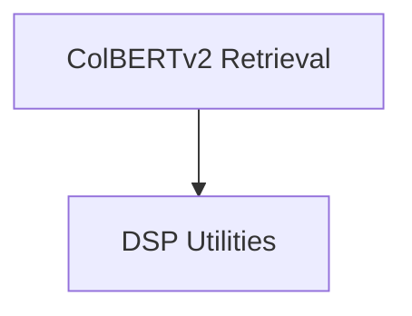

# DSPy DSP Utilities Module

## Introduction

This module (`dspy_dsp_utilities`) provides a collection of essential utilities for the DSPy framework, focusing on retrieval mechanisms (specifically ColBERTv2 integration) and general utility functions for tokenization, configuration management, and data loading.

It aims to offer robust and efficient tools that support various components within the DSPy ecosystem, enhancing its capabilities in areas like information retrieval and core system settings.

## Architecture Overview

The `dspy_dsp_utilities` module is structured into two main sub-modules:

1.  **ColBERTv2 Retrieval**: Handles all interactions with the ColBERTv2 retrieval system, including local indexing, searching, and reranking, as well as remote API interactions.
2.  **DSP Utilities**: Provides general-purpose utilities such as text tokenization, answer localization, a singleton for DSPy settings management, and functions for loading background data.

These sub-modules work together to provide core functionalities for DSPy applications that require advanced retrieval or general-purpose utility functions. The `Settings` component plays a crucial role in managing the global configuration for the entire DSPy framework.

<!-- DIAGRAM_JSON
{
    "direction": "TD",
    "nodes": [
        {"id": "colbert_retrieval", "label": "ColBERTv2 Retrieval", "type": "module", "link": "colbert_retrieval.md"},
        {"id": "dsp_utils", "label": "DSP Utilities", "type": "module", "link": "dsp_utils.md"}
    ],
    "edges": [
        {"source": "colbert_retrieval", "target": "dsp_utils"}
    ],
    "groups": []
}
-->

## Sub-modules

### [ColBERTv2 Retrieval](colbert_retrieval.md)
This sub-module provides local and remote functionalities for ColBERTv2 retrieval and reranking, including index building and searching.

### [DSP Utilities](dsp_utils.md)
This sub-module contains utility functions for tokenization, answer location, DSPy configuration settings, and background data loading.