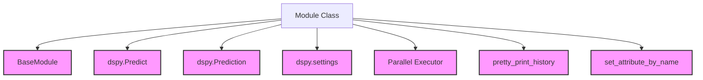

# dspy_module_api

The `dspy_module_api` module is a cornerstone of the DSPy framework, providing the foundational `Module` class from which all DSPy programs inherit. This module enables the composition of various components like predictors and sub-modules, forming complex pipelines that can be optimized through DSPy's teleprompting techniques. It abstracts away common functionalities required for building robust and adaptable language model-based applications.

## Core Functionality

The `Module` class serves as the base for defining the logic and structure of DSPy programs. Key functionalities include:

*   **Program Definition**: All DSPy programs are built by inheriting from `dspy.Module` and implementing a `forward` method, which encapsulates the program's execution logic.
*   **Predictor Management**: Provides methods to easily access and manage `dspy.Predict` instances within the module, such as `named_predictors()` and `predictors()`.
*   **Language Model (LM) Configuration**: Allows setting a language model for all internal predictors (`set_lm()`) and retrieving the configured LM (`get_lm()`).
*   **Execution Flow**: Manages the synchronous (`__call__`) and asynchronous (`acall`) execution of the module's `forward` method, integrating with DSPy's settings for usage tracking and callback handling.
*   **Batch Processing**: The `batch()` method facilitates parallel execution of the module's `forward` method across multiple `dspy.Example` instances, enhancing efficiency for large datasets.
*   **History and Debugging**: Offers `inspect_history()` for viewing the call history of language models within the module, aiding in debugging and understanding program behavior.
*   **Dynamic Predictor Transformation**: `map_named_predictors()` allows applying a function to all internal predictors, enabling dynamic modification or wrapping of prediction components.

## Architecture and Component Relationships

The `dspy_module_api` module, specifically the `Module` class, integrates with several other core DSPy components to provide its comprehensive functionality. It extends `BaseModule` for fundamental module capabilities and relies on `dspy.Predict` for individual prediction steps. It also interacts with DSPy's global `settings` for configuration, `Prediction` objects for structured outputs, and various utility functions for internal operations like callback handling and history tracking.

<!-- DIAGRAM_JSON
{
    "direction": "TD",
    "nodes": [
        {"id": "module_class", "label": "Module Class", "type": "component", "link": null},
        {"id": "base_module", "label": "BaseModule", "type": "external", "link": "base_module_core.md"},
        {"id": "predictor", "label": "dspy.Predict", "type": "external", "link": "dspy_prediction_strategies.md"},
        {"id": "prediction_output", "label": "dspy.Prediction", "type": "external", "link": "dspy_primitives.md"},
        {"id": "settings_config", "label": "dspy.settings", "type": "external", "link": "dspy_dsp_utilities.md"},
        {"id": "parallel_exec", "label": "Parallel Executor", "type": "external", "link": "dspy_utilities.md"},
        {"id": "history_util", "label": "pretty_print_history", "type": "external", "link": "dspy_utilities.md"},
        {"id": "attr_util", "label": "set_attribute_by_name", "type": "external", "link": "dspy_utilities.md"}
    ],
    "edges": [
        {"source": "module_class", "target": "base_module"},
        {"source": "module_class", "target": "predictor"},
        {"source": "module_class", "target": "prediction_output"},
        {"source": "module_class", "target": "settings_config"},
        {"source": "module_class", "target": "parallel_exec"},
        {"source": "module_class", "target": "history_util"},
        {"source": "module_class", "target": "attr_util"}
    ],
    "groups": []
}
-->

## How it Fits into the Overall System

The `dspy_module_api` module is central to the DSPy programming model. By providing the `Module` base class, it establishes the fundamental structure for defining any DSPy program, from simple pipelines to complex multi-step reasoning systems. This design promotes modularity, reusability, and composability, allowing developers to build sophisticated LM-powered applications by combining smaller, testable `Module` instances. It acts as the backbone upon which teleprompters (optimizers) can iterate and improve the performance of DSPy programs by modifying the underlying `Predict` components and their parameters. Its integration with other DSPy utilities ensures a coherent and powerful framework for developing and optimizing language model applications.
