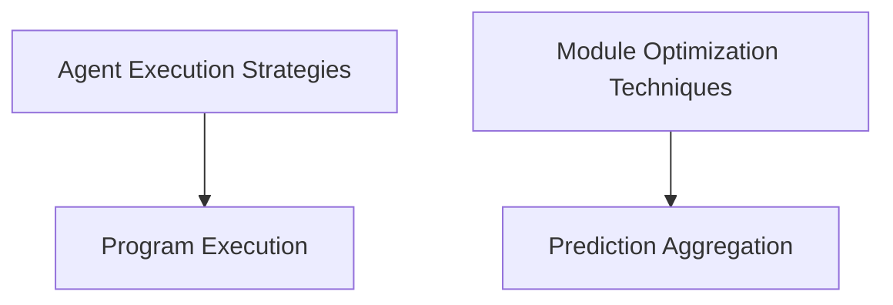

# DSPy Prediction Strategies

The `dspy_prediction_strategies` module encompasses a collection of advanced techniques and modules designed to enhance the prediction capabilities and agentic behavior within DSPy programs. It provides mechanisms for aggregating predictions, implementing sophisticated agent reasoning paradigms (like ReAct, CodeAct, and Recursive Language Models), optimizing module performance through iterative refinement, and executing programmatic thoughts.

## Architecture Overview

The `dspy_prediction_strategies` module is structured into several key sub-modules, each addressing a specific aspect of prediction and agentic control:

<!-- DIAGRAM_JSON
{
    "direction": "TD",
    "nodes": [
        {"id": "prediction_aggregation", "label": "Prediction Aggregation", "type": "module", "link": "prediction_aggregation.md"},
        {"id": "agent_strategies", "label": "Agent Execution Strategies", "type": "module", "link": "agent_strategies.md"},
        {"id": "module_optimization", "label": "Module Optimization Techniques", "type": "module", "link": "module_optimization.md"},
        {"id": "program_execution", "label": "Program Execution", "type": "module", "link": "program_execution.md"}
    ],
    "edges": [
        {"source": "agent_strategies", "target": "program_execution"},
        {"source": "module_optimization", "target": "prediction_aggregation"}
    ],
    "groups": []
}
-->

## Sub-modules and their Functionality

### [Prediction Aggregation](prediction_aggregation.md)
This sub-module focuses on combining outputs from multiple predictions to arrive at a more robust or desired final answer. It includes utilities for determining the majority prediction and normalizing text outputs.

### [Agent Execution Strategies](agent_strategies.md)
This collection of components provides various advanced agentic paradigms. It includes implementations for Avatar (tool-using agents), CodeAct (agents leveraging code interpreters), ReAct (Reasoning and Acting agents for tool usage), and RLM (Recursive Language Models for exploring large contexts via REPL).

### [Module Optimization Techniques](module_optimization.md)
This sub-module offers strategies to improve the performance and reliability of DSPy modules. It features `BestOfN` for selecting the best output from multiple attempts and `Refine` for iterative improvement with feedback, along with utilities for inspecting modules and generating feedback.

### [Program Execution](program_execution.md)
Dedicated to enabling the execution of Python programs as part of a module's thought process. This allows DSPy modules to programmatically solve problems by generating and executing code within an interpreter.