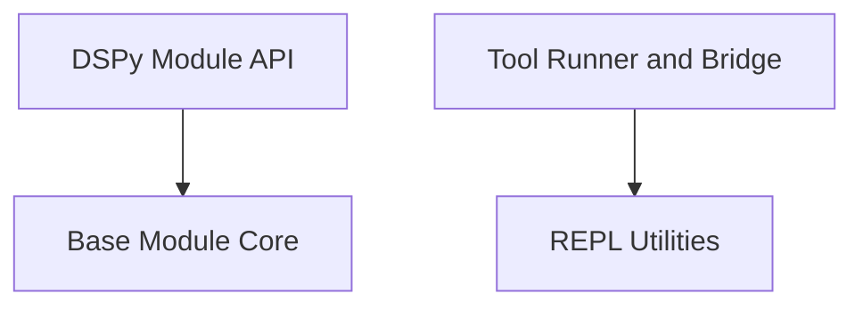

# DSPy Primitives Module

The `dspy_primitives` module serves as the foundational layer for building and managing DSPy programs. It defines the core abstractions for DSPy modules, handles their lifecycle (initialization, parameter management, state serialization), and provides utilities for interacting with different execution environments.

## Architecture Overview

This module is structured into several key sub-modules, each responsible for a specific aspect of DSPy's primitive functionalities. The relationships and dependencies between these components are illustrated in the diagram below:

<!-- DIAGRAM_JSON
{
    "direction": "TD",
    "nodes": [
        {"id": "base_module_core", "label": "Base Module Core", "type": "module", "link": "base_module_core.md"},
        {"id": "dspy_module_api", "label": "DSPy Module API", "type": "module", "link": "dspy_module_api.md"},
        {"id": "repl_utilities", "label": "REPL Utilities", "type": "module", "link": "repl_utilities.md"},
        {"id": "tool_runner", "label": "Tool Runner and Bridge", "type": "module", "link": "tool_runner.md"}
    ],
    "edges": [
        {"source": "dspy_module_api", "target": "base_module_core"},
        {"source": "tool_runner", "target": "repl_utilities"}
    ],
    "groups": []
}
-->

## Sub-modules

Here's a brief overview of the sub-modules within `dspy_primitives`:

### [Base Module Core](base_module_core.md)

This sub-module provides the fundamental functionalities for all DSPy modules, including parameter introspection, deep copying, and state management. It defines the `BaseModule` class, which serves as the ancestor for all programmable DSPy components.

### [DSPy Module API](dspy_module_api.md)

Building upon the `BaseModule`, this sub-module introduces DSPy-specific features for program execution. It includes the `Module` class, which is the base for all DSPy programs, offering capabilities like history tracking, language model configuration, and batch processing of examples.

### [REPL Utilities](repl_utilities.md)

This sub-module defines data structures for representing variable metadata within a Read-Eval-Print Loop (REPL) environment. The `REPLVariable` class helps in providing detailed introspection and formatting of variables for improved developer experience.

### [Tool Runner and Bridge](tool_runner.md)

This sub-module is responsible for facilitating the creation of Python wrappers for tools and managing the communication bridge for executing these tools in different environments. It includes JavaScript components that handle the dynamic generation of Python tool functions and their interaction with a host environment.