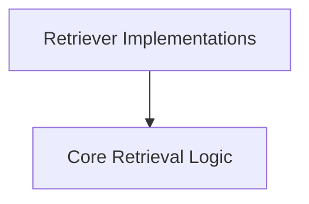

# DSPy Retrievers Module

## Introduction

The `dspy_retrievers` module provides a foundational and extensible framework for integrating various retrieval mechanisms into DSPy programs. It abstracts the complexities of interacting with different data sources and vector stores, allowing users to define how their DSPy applications fetch relevant information. This module is crucial for enabling knowledge-intensive applications by providing components that can search and retrieve pertinent passages based on a given query.

## Architecture

The `dspy_retrievers` module is organized into two main sub-modules: `core_retrieval` and `retriever_implementations`. The `core_retrieval` sub-module establishes the fundamental interfaces and utilities for retrieval operations, while `retriever_implementations` provides concrete connectors to external retrieval systems like Databricks Vector Search and Weaviate.

<!-- DIAGRAM_JSON
{
    "direction": "TD",
    "nodes": [
        {"id": "core_retrieval", "label": "Core Retrieval Logic", "type": "module", "link": "core_retrieval.md"},
        {"id": "retriever_implementations", "label": "Retriever Implementations", "type": "module", "link": "retriever_implementations.md"}
    ],
    "edges": [
        {"source": "retriever_implementations", "target": "core_retrieval"}
    ],
    "groups": []
}
-->

## Sub-modules

### [Core Retrieval Logic](core_retrieval.md)

This sub-module defines the essential components for building and extending retrieval functionality within DSPy. It includes the base `Retrieve` class, which all retrievers inherit from, providing a standardized interface for search operations. Additionally, it offers `EmbeddingsWithScores` for scenarios requiring similarity scores alongside retrieved passages and a utility for processing single query passages.

### [Retriever Implementations](retriever_implementations.md)

This sub-module houses specific implementations of retrieval models that connect DSPy to various external vector search indexes and knowledge bases. It currently includes `DatabricksRM` for integrating with Databricks Mosaic AI Vector Search and `WeaviateRM` for interacting with Weaviate collections. These implementations handle the specifics of querying their respective backend systems and returning results in a DSPy-compatible format.
